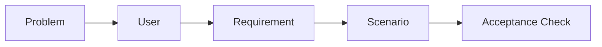
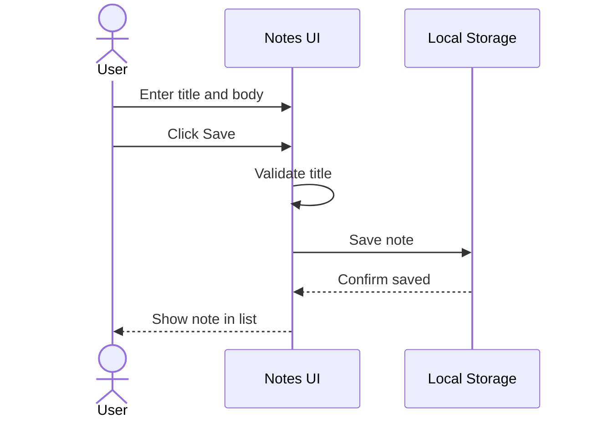
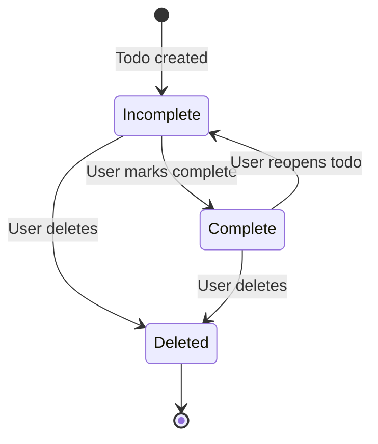
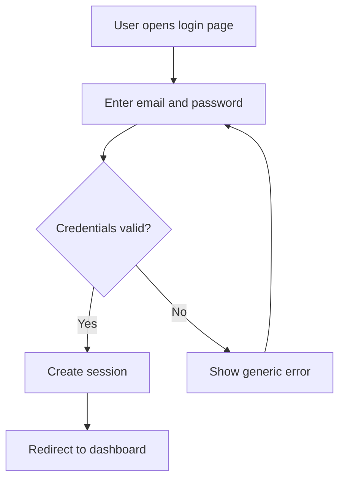
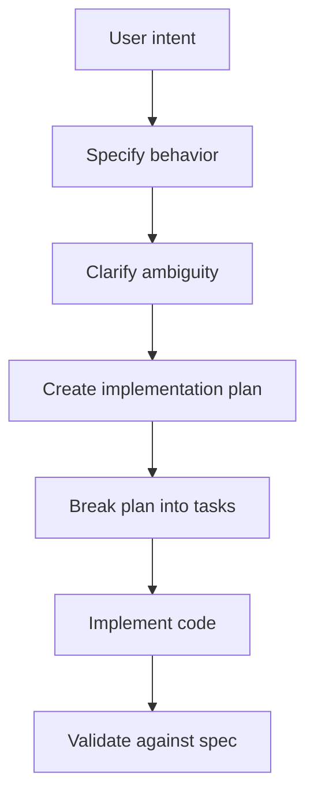
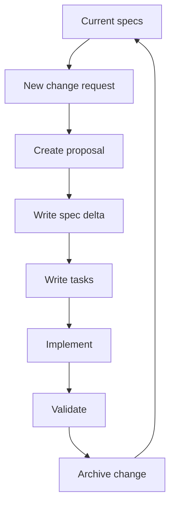
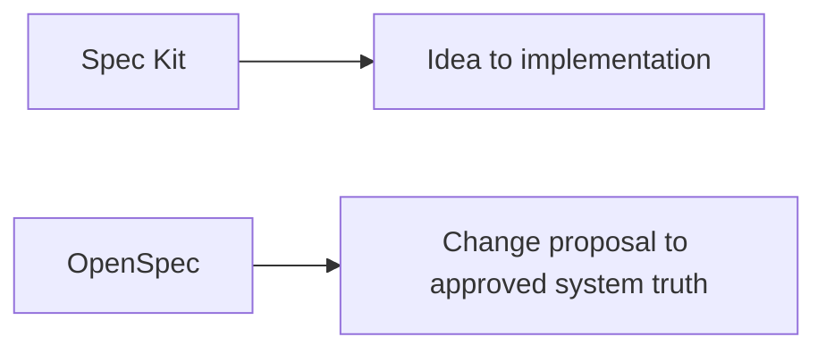

# Spec Methodology: Examples And Diagrams

This lesson makes the basic spec methodology concrete.

The central idea:

```text
Do not start with code.
Start with shared understanding.
```

## 1. The Smallest Useful Spec

A small but useful spec has five parts:

```text
Problem -> User -> Requirement -> Scenario -> Acceptance Check
```



## Example 1: Tiny Notes App

### Weak Request

```text
Build a notes app.
```

This is too broad. The AI or developer must guess too much.

### Better Spec

```text
Problem:
Users need a quick way to capture short notes without opening a complex document tool.

User:
A learner who wants to save short study notes while reading.

Requirement:
The system shall allow the user to create a note with a title and body.

Scenario:
Given I am on the notes page
When I enter a title and body and click Save
Then the note appears in my notes list

Acceptance Check:
- A note cannot be saved without a title.
- A saved note appears immediately in the list.
- The note remains visible after refreshing the page.
```

### Diagram



## Example 2: Todo App

### Weak Request

```text
Add todos.
```

This does not say what a todo means, what fields it has, or what done looks like.

### Better Spec

```text
Problem:
Users need to track small tasks and mark them complete.

User:
A person managing daily personal tasks.

Requirement:
The system shall allow users to add, complete, and delete todo items.

Scenario:
Given I have an empty todo list
When I add "Pay electricity bill"
Then the todo list shows "Pay electricity bill" as incomplete

Scenario:
Given a todo item is incomplete
When I mark it complete
Then it appears as completed

Acceptance Check:
- Empty todo text is rejected.
- New todos are incomplete by default.
- Completed todos remain visible unless deleted.
```

### Diagram



## Example 3: Login Feature

### Weak Request

```text
Make login work.
```

This is risky because login has security, error, and session behavior.

### Better Spec

```text
Problem:
Only registered users should access private pages.

User:
A registered account holder.

Requirement:
The system shall authenticate users using email and password.

Scenario:
Given I have a valid account
When I enter the correct email and password
Then I am redirected to the dashboard

Scenario:
Given I enter an incorrect password
When I submit the login form
Then I remain on the login page and see an error message

Acceptance Check:
- Password input is hidden.
- Failed login does not reveal whether the email exists.
- Successful login creates a session.
- Private pages require an active session.
```

### Diagram



## Spec Kit Style Flow

Spec Kit-style methodology usually moves from high-level intent toward implementation tasks.



Typical files might look like this:

```text
specs/
  notes-app/
    spec.md
    plan.md
    tasks.md
```

## OpenSpec Style Flow

OpenSpec separates the current truth from proposed changes.



Typical files might look like this:

```text
openspec/
  specs/
    notes-management/
      spec.md

  changes/
    add-note-search/
      proposal.md
      design.md
      tasks.md
      specs/
        notes-management/
          spec.md
```

## How To Think About The Difference

Spec Kit is especially useful when you want an AI agent to move from idea to implementation through a structured pipeline.

OpenSpec is especially useful when you want to manage proposed changes against a known system truth.



## A Reusable Template

Use this when starting any small feature:

```text
# Feature Spec

## Problem

What pain or need exists?

## User

Who needs this?

## Requirement

The system shall...

## Scenarios

### Scenario 1

Given...
When...
Then...

## Acceptance Checks

- Check 1
- Check 2
- Check 3

## Out Of Scope

- Thing we are not doing now
```

## Practice

Rewrite this weak request into a spec:

```text
Create a search feature for notes.
```

Use:

```text
Problem:
User:
Requirement:
Scenario:
Acceptance Check:
Out Of Scope:
```

