# Spec Methodology: PySpark Data Engineering Example

Example goal:

```text
Read a CSV, run a SQL transformation, and store the result as CSV.
```

This is a good data engineering example because it has a simple pipeline shape:

```text
Input -> Transform -> Output
```

## Learning Goal

By the end of this document, you should understand how a simple PySpark requirement becomes:

```text
Rough requirement -> Refined spec -> Clarification questions -> Plan -> Tasks -> Code -> Tests -> Validation
```

This document is meant to be a living learning document. You can keep improving it as the example becomes more realistic.

## Methodology First

Spec methodology is the practice of turning intent into structured implementation guidance before writing code.

For data engineering, this matters because pipeline requests often sound simple while hiding many important decisions.

The core methodology is:

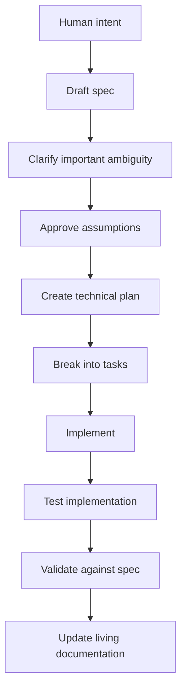

The same flow can be viewed by responsibility:

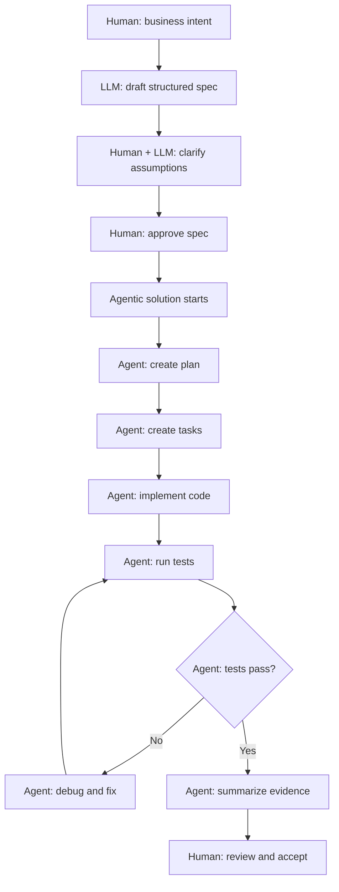

In this diagram, the **agentic solution is in play after the human approves the spec**. Before that point, the LLM is mainly helping with thinking, clarification, and structure. After approval, the agent can execute the plan, run tools, test, and iterate.

For a data pipeline, the spec should make these contracts clear:

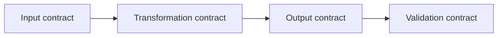

The four contracts mean:

- **Input contract**: What data arrives, where it is, and what shape it has.
- **Transformation contract**: What business or technical rule is applied.
- **Output contract**: What result is produced, where it goes, and in what format.
- **Validation contract**: How we know the job worked correctly.

For this example:

```text
Input contract:
Read sales.csv with a header row.

Transformation contract:
Use SQL to calculate total sales by region.

Output contract:
Write region-level totals as CSV.

Validation contract:
Confirm the output has region and total_sales with expected totals.
```

## Weak Request

```text
Create a PySpark job that reads a CSV, runs SQL, and writes CSV.
```

This sounds clear, but it leaves many questions unanswered:

- Where is the input CSV?
- Does the CSV have a header?
- What schema should be used?
- What SQL should run?
- Should bad records fail the job or be skipped?
- Where should output be written?
- Should output be overwritten or appended?
- How do we know the job worked?

Spec methodology turns those hidden assumptions into explicit decisions.

## Who Defines The Spec?

The human defines the intent. The LLM can help refine that intent into a usable spec.

The workflow is:

```text
Human gives direction.
LLM structures, clarifies, and expands.
Human approves.
Then implementation starts.
```

For this PySpark example, the human might start with:

```text
I need a PySpark job.
It should read a sales CSV.
Run SQL to calculate total sales by region.
Write the output as CSV.
Keep it simple for learning.
```

The LLM can then refine it into:

```text
Requirement:
The system shall read a sales CSV file, calculate total sales by region using Spark SQL, and write the aggregated result as a CSV output.

Input:
CSV file with header:
order_id, region, product, quantity, unit_price

Transformation:
total_sales = SUM(quantity * unit_price), grouped by region

Output:
CSV with header:
region, total_sales

Acceptance Checks:
- Reads CSV with header enabled
- Registers input as SQL view
- Groups by region
- Writes CSV with header
- Overwrites prior output for repeatable learning runs
```

The LLM should ask questions until the spec is clear enough to build safely, not endlessly.

Good clarification questions would be:

```text
1. What columns are in the input CSV?
2. What SQL transformation should be applied?
3. Where should the output be written?
4. Should the output overwrite existing files or append?
5. Should invalid rows fail the job or be ignored?
```

For a learning project, the LLM can also propose reasonable defaults:

```text
Assumptions:
- CSV has a header.
- inferSchema is acceptable.
- Output mode is overwrite.
- Invalid records are out of scope.
- Local file paths are used.
```

The rule is:

```text
Ask only the questions that would materially change the implementation.
Use reasonable defaults for the rest.
```

The LLM can draft the spec, but the human should approve it because the human owns the intent.

## Methodology Applied To This Example

Here is the same methodology applied to the PySpark pipeline:

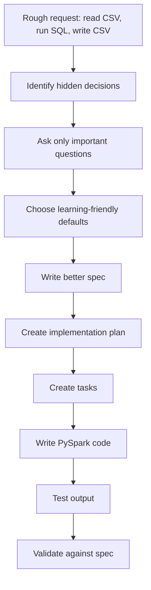

The key learning move is this:

```text
Do not ask the LLM to code immediately.
Ask it to first make the data contract explicit.
```

Here is the same process with the agentic section marked:

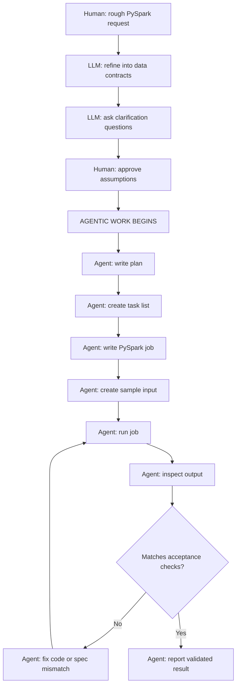

## Human, LLM, And Agent Roles

The terms can blur, so it helps to separate them:

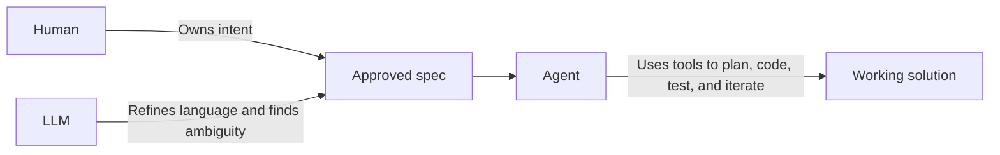

For this document:

```text
Human:
I want a PySpark job that reads CSV, runs SQL, writes CSV.

LLM:
Here is the refined spec, assumptions, scenarios, and acceptance checks.

Agent:
I will create the files, run the job, test the output, fix failures, and report evidence.
```

## Better Spec

```text
Problem:
Raw sales data arrives as a CSV file. A learner needs a simple PySpark job that reads the file, runs a SQL aggregation, and writes the result to another CSV folder.

User:
A data engineer learning PySpark batch processing.

Requirement:
The system shall read a sales CSV file, aggregate total sales by region using Spark SQL, and write the aggregated result as CSV.

Input:
The input CSV contains a header row and these columns:
- order_id
- region
- product
- quantity
- unit_price

Transformation:
Create a calculated column named total_amount as quantity * unit_price.
Group by region.
Calculate total_sales as the sum of total_amount.

Output:
Write the result as CSV with a header row.

Scenario:
Given a sales CSV file with valid records
When the PySpark job runs
Then it creates a CSV output containing one row per region with total_sales

Acceptance Checks:
- The job reads the CSV with header enabled.
- The job creates a temporary SQL view.
- The SQL groups records by region.
- The output contains region and total_sales.
- The output is written in CSV format with header enabled.
```

## Spec Kit View

Spec Kit-style thinking usually moves from feature intent to implementation through a structured flow:

```text
Specify -> Plan -> Tasks -> Implement
```

For this PySpark example, that would look like:

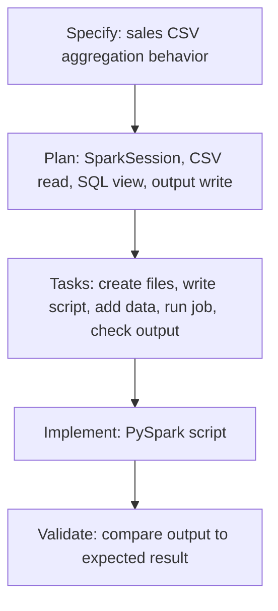

A Spec Kit-style folder could look like this:

```text
specs/
  pyspark-sales-by-region/
    spec.md
    plan.md
    tasks.md
```

### Spec Kit Style `spec.md`

```text
# Feature Spec: PySpark Sales By Region

## User Story

As a data engineer learning PySpark,
I want to read sales data from CSV, aggregate it using Spark SQL, and write the result as CSV,
so that I understand a basic batch data engineering pattern.

## Functional Requirements

- The job shall read a CSV file with a header row.
- The job shall register the input as a SQL view named sales.
- The job shall calculate total_sales as SUM(quantity * unit_price).
- The job shall group the result by region.
- The job shall write the result as CSV with a header row.

## Acceptance Criteria

- Given valid input sales data, when the job runs, then output is produced.
- Given the sample input, when aggregation runs, then East has total_sales 2225.
- Given the sample input, when aggregation runs, then West has total_sales 1125.
```

### Spec Kit Style `plan.md`

```text
# Plan

1. Create a SparkSession.
2. Read input CSV from data/input/sales.csv.
3. Enable header and inferSchema for the learning version.
4. Register the DataFrame as a temporary SQL view named sales.
5. Run Spark SQL aggregation.
6. Write output to data/output/sales_by_region in overwrite mode.
7. Validate output manually against expected values.
```

### Spec Kit Style `tasks.md`

```text
# Tasks

- [ ] Create sample input file.
- [ ] Create PySpark script.
- [ ] Read CSV with header enabled.
- [ ] Register SQL view.
- [ ] Add SQL aggregation.
- [ ] Write output CSV with header enabled.
- [ ] Run job locally.
- [ ] Confirm output values.
```

## OpenSpec View

OpenSpec-style thinking separates current system truth from proposed changes.

Instead of only asking "what should I build?", OpenSpec asks:

```text
What is currently true?
What change are we proposing?
What spec delta describes the new behavior?
What tasks implement that change?
```

For a brand-new PySpark example, the current truth might be empty:

```text
There is no existing sales aggregation pipeline.
```

The proposed change is:

```text
Add a PySpark batch job that reads sales CSV data, aggregates total sales by region using SQL, and writes the result as CSV.
```

An OpenSpec-style folder could look like this:

```text
openspec/
  specs/
    sales-aggregation/
      spec.md

  changes/
    add-pyspark-sales-by-region/
      proposal.md
      design.md
      tasks.md
      specs/
        sales-aggregation/
          spec.md
```

### OpenSpec Style `proposal.md`

```text
# Proposal: Add PySpark Sales By Region Pipeline

## Why

A learner needs a simple data engineering pipeline that demonstrates reading CSV data, transforming it with Spark SQL, and writing CSV output.

## What Changes

- Add a PySpark job for sales aggregation.
- Read sales input from CSV.
- Aggregate total sales by region.
- Write the result as CSV.

## Impact

- Introduces a basic batch processing example.
- Creates a foundation for future examples such as explicit schemas, bad record handling, Parquet output, and parameterized paths.
```

### OpenSpec Style `design.md`

```text
# Design

The job will use PySpark in local mode for learning.

The script will:

1. Create a SparkSession.
2. Read a local CSV file with header enabled.
3. Infer schema for the first learning version.
4. Register the input DataFrame as a temporary view named sales.
5. Run a SQL aggregation grouped by region.
6. Write the result as CSV with header enabled.

For repeatable learning runs, output mode will be overwrite.
```

### OpenSpec Style `tasks.md`

```text
# Tasks

- [ ] Add sample sales CSV.
- [ ] Add PySpark job file.
- [ ] Read input CSV.
- [ ] Register sales SQL view.
- [ ] Run aggregation SQL.
- [ ] Write output CSV.
- [ ] Validate sample output.
```

### OpenSpec Style Spec Delta

```text
## ADDED Requirements

### Requirement: Aggregate Sales By Region

The system SHALL read sales records from a CSV file and produce total sales by region.

#### Scenario: Valid sales CSV is processed

Given a sales CSV file with region, quantity, and unit_price columns
When the PySpark job runs
Then the output CSV contains one row per region
And each row contains region and total_sales
```

## Spec Kit And OpenSpec Difference

Both approaches help you avoid jumping straight from vague request to code.

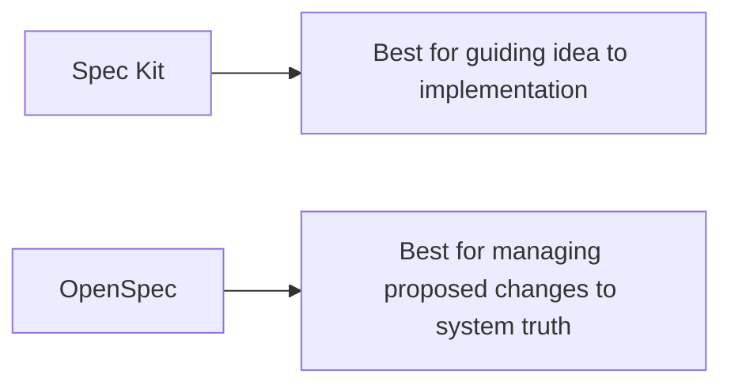

For learning, you can use both:

```text
Use Spec Kit thinking to move from idea to plan and tasks.
Use OpenSpec thinking to treat every improvement as a controlled change.
```

In this PySpark example:

- Spec Kit helps you build the first version.
- OpenSpec helps you add future improvements cleanly.

## Is This Agentic?

It can be.

The methodology itself is not automatically agentic. A spec can be written and followed by a human developer.

It becomes agentic when an AI agent actively uses the spec to drive the work.

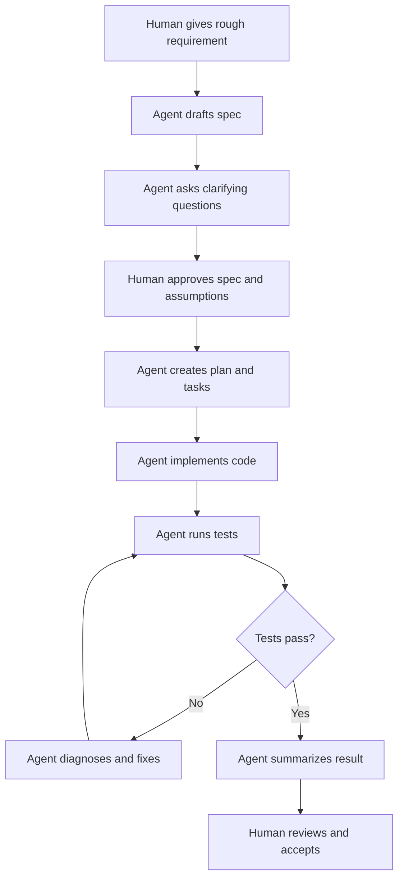

In an agentic workflow, the LLM is not only answering questions. It is doing work against the spec:

- drafting the spec
- identifying ambiguity
- proposing defaults
- creating implementation tasks
- writing code
- running tests
- comparing output to acceptance checks
- fixing failures
- updating the learning document or spec

The human still owns the intent and approval.

The agent owns the execution loop.

```text
Human: intent and judgment
Agent: structure, implementation, testing, iteration
```

For this PySpark example, an agentic instruction could be:

```text
Using the approved spec, create the PySpark job, add sample input data, run it locally, verify the output matches the acceptance checks, and update the tasks when complete.
```

Another way to see the agentic boundary:

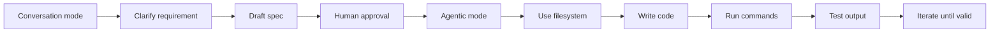

The boundary is not magic. It is practical:

```text
If the LLM is only explaining, it is conversational.
If it is using the spec to act, test, and iterate, it is agentic.
```

## Pipeline Diagram

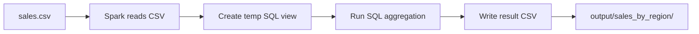

## Data Flow Diagram

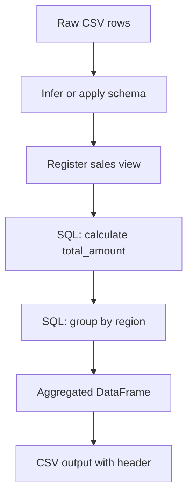

## Example Input

```csv
order_id,region,product,quantity,unit_price
1,East,Laptop,2,1000
2,West,Mouse,5,25
3,East,Keyboard,3,75
4,West,Laptop,1,1000
```

## Example SQL

```sql
SELECT
  region,
  SUM(quantity * unit_price) AS total_sales
FROM sales
GROUP BY region
ORDER BY region
```

## Expected Output

```csv
region,total_sales
East,2225
West,1125
```

## Implementation Plan

Before writing code, turn the spec into a plan.

```text
1. Start a SparkSession.
2. Read the input CSV with header enabled.
3. Register the DataFrame as a temporary view named sales.
4. Run Spark SQL to aggregate sales by region.
5. Write the result as CSV with header enabled.
6. Stop the SparkSession.
```

## Task Breakdown

```text
- Create project folder.
- Add sample input CSV.
- Add PySpark script.
- Define input and output paths.
- Read CSV.
- Register SQL view.
- Run aggregation query.
- Write output CSV.
- Add simple run instructions.
- Validate output manually or with a small test.
```

## PySpark Code Example

```python
from pyspark.sql import SparkSession


def main():
    spark = (
        SparkSession.builder
        .appName("SalesByRegion")
        .getOrCreate()
    )

    input_path = "data/input/sales.csv"
    output_path = "data/output/sales_by_region"

    sales_df = (
        spark.read
        .option("header", "true")
        .option("inferSchema", "true")
        .csv(input_path)
    )

    sales_df.createOrReplaceTempView("sales")

    result_df = spark.sql("""
        SELECT
          region,
          SUM(quantity * unit_price) AS total_sales
        FROM sales
        GROUP BY region
        ORDER BY region
    """)

    (
        result_df.write
        .mode("overwrite")
        .option("header", "true")
        .csv(output_path)
    )

    spark.stop()


if __name__ == "__main__":
    main()
```

## Testing The Solution

Testing should be part of the methodology, not an afterthought.

For this PySpark example, testing answers:

```text
Did the implementation satisfy the spec?
```

Use three levels of testing:

```text
1. Input test
2. Transformation test
3. Output test
```

### Input Test

Check that Spark can read the CSV and that the expected columns exist.

Expected columns:

```text
order_id
region
product
quantity
unit_price
```

### Transformation Test

Check that the SQL logic calculates the expected totals.

Using the sample input:

```csv
order_id,region,product,quantity,unit_price
1,East,Laptop,2,1000
2,West,Mouse,5,25
3,East,Keyboard,3,75
4,West,Laptop,1,1000
```

The expected result is:

```csv
region,total_sales
East,2225
West,1125
```

### Output Test

Check that the job writes CSV output with a header row and the expected values.

Validation checks:

```text
- Output folder exists.
- Output is CSV.
- Header is enabled.
- Columns are region and total_sales.
- East total_sales is 2225.
- West total_sales is 1125.
- Rerunning the job overwrites the prior output.
```

## Testing Diagram

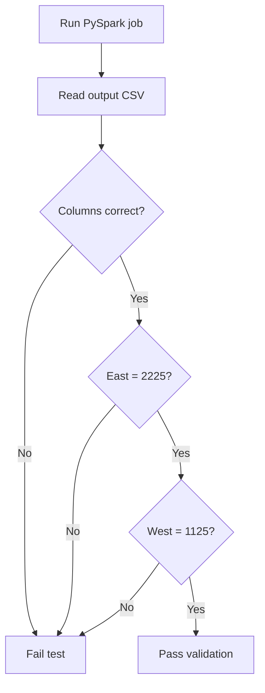

## Agentic Testing Loop

In an agentic solution, testing is not just a checklist. The agent uses test results to decide the next action.

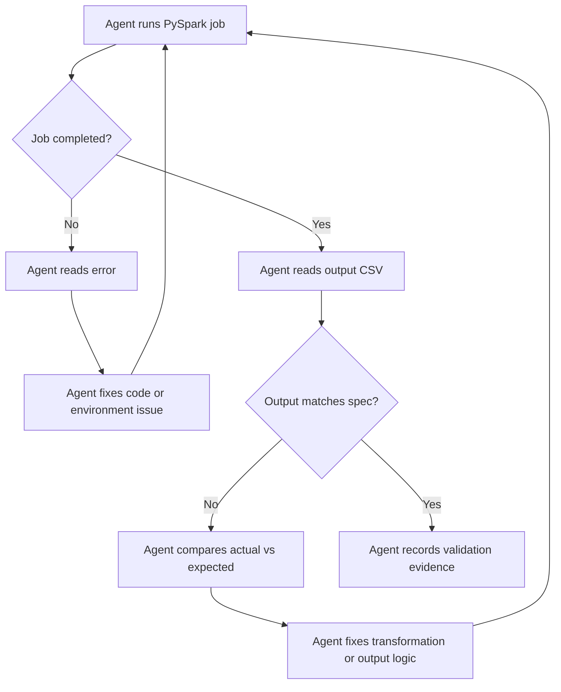

## Agentic Evidence Diagram

The agent should not merely say "done." It should produce evidence tied to the spec.

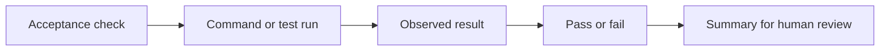

For this example:

```text
Acceptance check:
East total_sales is 2225.

Evidence:
Output CSV contains East,2225.

Result:
Pass.
```

## Agentic Review And Judge Model

For stronger quality control, the solution should not stop after the builder agent creates and tests it.

A better agentic methodology is:

```text
Builder Agent -> Reviewer Agent -> Multiple Judge Agents -> Human Acceptance
```

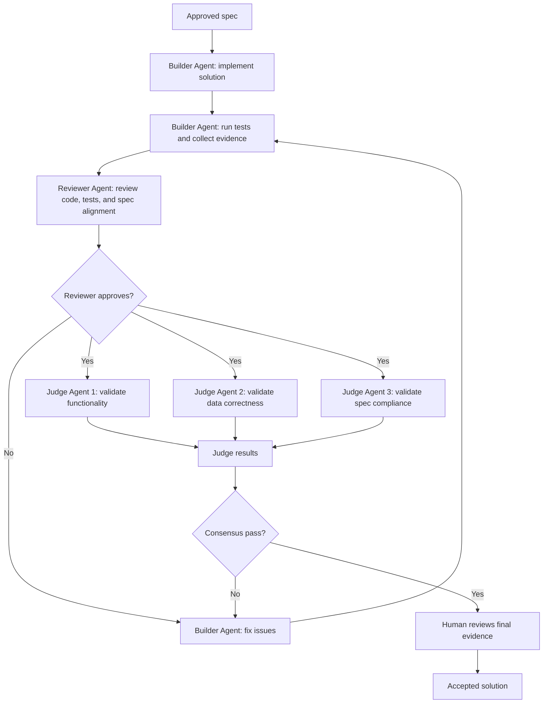

## Agent Roles

Each agent has a different responsibility.

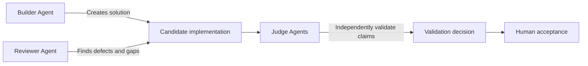

### Builder Agent

The builder agent creates the solution.

Responsibilities:

- implement the PySpark job
- add sample input data
- run the job
- produce output
- run validation checks
- fix failures found during its own loop
- summarize what changed

### Reviewer Agent

The reviewer agent performs a critical review.

It should not simply trust the builder.

Responsibilities:

- compare implementation against the spec
- inspect the PySpark logic
- check whether tests are meaningful
- identify missing edge cases
- check whether assumptions were added without approval
- request fixes before judge validation

### Judge Agents

Judge agents independently validate the solution.

Multiple judges are useful because each judge can focus on a different quality dimension.

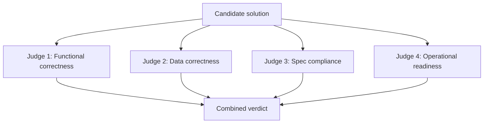

Example judge responsibilities for this PySpark pipeline:

```text
Judge 1: Functional correctness
- Does the job run?
- Does it read input and write output?

Judge 2: Data correctness
- Are East and West totals correct?
- Is total_sales calculated correctly?

Judge 3: Spec compliance
- Does the solution match the approved spec?
- Did the implementation add unapproved behavior?

Judge 4: Operational readiness
- Is output mode clear?
- Are paths understandable?
- Can the job be rerun?
```

## Multi-Judge Validation Flow

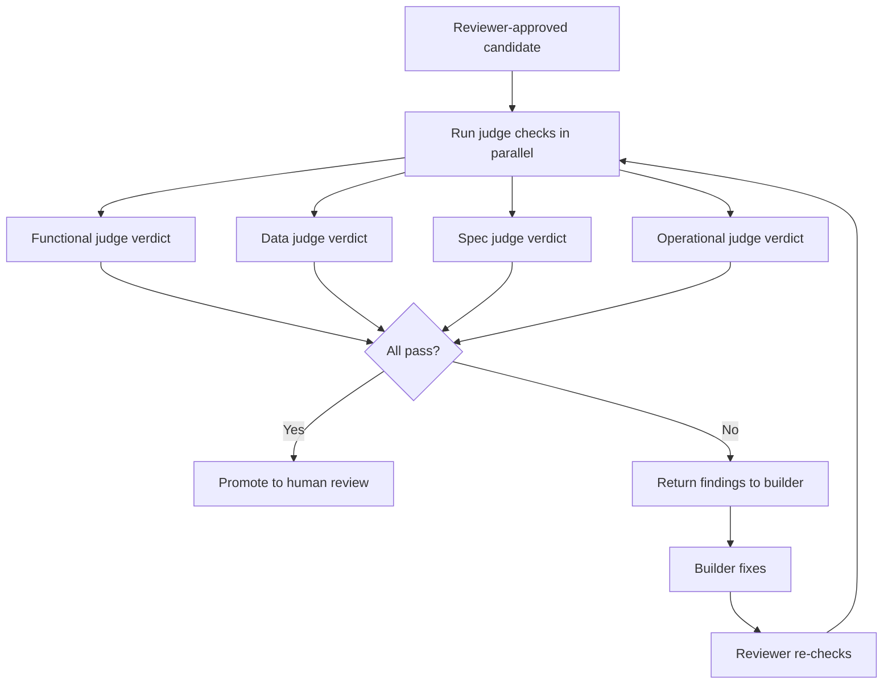

## Review And Judge Evidence Table

The final result should include evidence from the builder, reviewer, and judges.

```text
Builder Evidence:
- Job ran successfully.
- Output CSV was created.
- Sample totals matched expected values.

Reviewer Evidence:
- Code matches approved spec.
- SQL aggregation is correct.
- Tests are tied to acceptance checks.

Judge Evidence:
- Functional judge: pass
- Data correctness judge: pass
- Spec compliance judge: pass
- Operational readiness judge: pass
```

## Updated Agentic Methodology

With review and judges included, the full methodology becomes:

```text
Intent
-> Spec
-> Clarification
-> Human approval
-> Builder agent implementation
-> Builder tests
-> Reviewer agent critique
-> Builder fixes
-> Multi-judge validation
-> Human acceptance
-> Living spec update
```

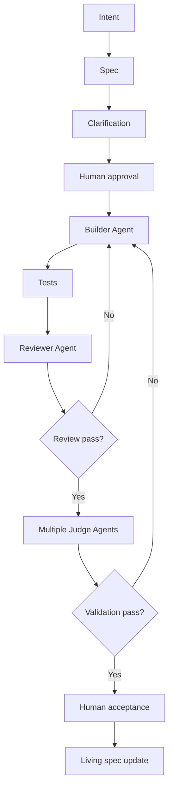

## Test Task List

```text
- [ ] Create sample input CSV.
- [ ] Run the PySpark job.
- [ ] Read the output CSV.
- [ ] Confirm columns are region and total_sales.
- [ ] Confirm East total_sales is 2225.
- [ ] Confirm West total_sales is 1125.
- [ ] Confirm output folder is overwritten on rerun.
```

## Where Testing Fits In Spec Kit

In Spec Kit-style thinking, testing appears in three places:

```text
spec.md:
Acceptance criteria

plan.md:
Validation approach

tasks.md:
Test and verification tasks
```

Example:

```text
Acceptance Criteria:
- Given the sample input, East total_sales equals 2225.
- Given the sample input, West total_sales equals 1125.
- The output CSV contains a header row.

Validation Plan:
- Run the job locally.
- Read the output CSV.
- Compare actual totals to expected totals.

Tasks:
- [ ] Add sample input data.
- [ ] Run job.
- [ ] Verify output values.
```

## Where Testing Fits In OpenSpec

In OpenSpec-style thinking, testing appears in the proposed change:

```text
proposal.md:
Expected impact

design.md:
Validation strategy

tasks.md:
Concrete test tasks

spec delta:
Scenarios that prove the requirement
```

Example spec delta:

```text
### Requirement: Validate Sales Aggregation Output

The system SHALL produce correct total sales for each region from the sample input.

#### Scenario: Sample input is aggregated

Given the sample sales CSV
When the PySpark job runs
Then the output contains East with total_sales 2225
And the output contains West with total_sales 1125
```

With testing included, the full methodology is:

```text
Intent -> Spec -> Clarification -> Plan -> Tasks -> Code -> Test -> Validate -> Living Spec
```

## Spec To Code Traceability

Traceability means every important line of code has a reason in the spec.

```mermaid
flowchart LR
    A["Requirement: read CSV"] --> B["spark.read.csv"]
    C["Requirement: SQL transform"] --> D["createOrReplaceTempView + spark.sql"]
    E["Requirement: write CSV"] --> F["result_df.write.csv"]
    G["Acceptance: header enabled"] --> H["option header true"]
    I["Acceptance: overwrite output"] --> J["mode overwrite"]
```

## What This Teaches

This example shows that even a small data engineering task benefits from a spec.

Without a spec, the developer guesses.

With a spec, the developer knows:

- the input contract
- the transformation rule
- the output contract
- the validation checks
- what is out of scope

## Out Of Scope For This First Version

Keep the first version simple.

```text
Out Of Scope:
- Complex schema validation
- Bad record quarantine
- Partitioned output
- Unit tests
- Deployment to Databricks, EMR, or Fabric
- Reading from cloud storage
- Writing Parquet or Delta
```

These can become future change specs.

## Future Change Examples

Once the basic pipeline works, each improvement should be its own spec.

```text
Change 1:
Add explicit schema instead of inferSchema.

Change 2:
Write output as Parquet.

Change 3:
Partition output by region.

Change 4:
Reject records with missing region.

Change 5:
Add a job parameter for input and output paths.
```

## Future Changes As OpenSpec Changes

Each future improvement can become a separate OpenSpec change.

```mermaid
flowchart TD
    A["Current spec: simple CSV to CSV aggregation"] --> B["Change: add explicit schema"]
    A --> C["Change: write Parquet"]
    A --> D["Change: reject bad records"]
    A --> E["Change: parameterize paths"]
    B --> F["Updated living spec"]
    C --> F
    D --> F
    E --> F
```

Example:

```text
openspec/changes/add-explicit-schema/
  proposal.md
  design.md
  tasks.md
  specs/
    sales-aggregation/
      spec.md
```

The methodology stays the same:

```text
Do not hide a new behavior inside code.
Describe the behavior change first, then implement it.
```

## OpenSpec Vs Spec Kit Side By Side

Both OpenSpec and Spec Kit help you avoid jumping from a vague request directly into code.

They differ in emphasis.

```text
Spec Kit:
Best for moving from idea to implementation.

OpenSpec:
Best for managing proposed changes against a living system truth.
```

Using the same PySpark example:

```text
Read sales CSV -> Run SQL aggregation -> Write result CSV
```

## Side By Side Comparison

| Question | Spec Kit | OpenSpec |
|---|---|---|
| Main purpose | Guide implementation from intent | Manage behavior changes against current specs |
| Mental model | "What should we build?" | "What change are we proposing?" |
| Best use | Creating a new feature or project flow | Evolving an existing system safely |
| Main flow | Specify -> Plan -> Tasks -> Implement | Proposal -> Design -> Tasks -> Spec Delta -> Archive |
| Source of truth | Feature spec and generated plan/tasks | `openspec/specs/` after approved changes are archived |
| Change handling | Usually starts from the requested feature | Explicitly models each change as a separate proposal |
| Human role | Approve spec, plan, and implementation direction | Approve proposal and spec delta |
| Agent role | Generate plan, tasks, code, tests | Generate change files, implementation, validation, archive updates |
| Testing location | Acceptance criteria, validation plan, task checklist | Design validation, task checklist, spec scenarios |
| PySpark example focus | Build the CSV -> SQL -> CSV job | Add or evolve the sales aggregation capability |

## Same Example In Spec Kit

Spec Kit treats the PySpark pipeline as a feature to build.

```mermaid
flowchart TD
    A["Idea: PySpark CSV to CSV job"] --> B["Specify behavior"]
    B --> C["Plan implementation"]
    C --> D["Create tasks"]
    D --> E["Implement job"]
    E --> F["Run tests"]
    F --> G["Validate output"]
```

Spec Kit-style artifacts:

```text
specs/
  pyspark-sales-by-region/
    spec.md
    plan.md
    tasks.md
```

The example in Spec Kit language:

```text
spec.md:
The job shall read sales.csv, aggregate total sales by region using Spark SQL, and write a CSV output.

plan.md:
Use SparkSession, read CSV with header, create sales temp view, run SQL, write CSV in overwrite mode.

tasks.md:
- Add sample CSV
- Add PySpark script
- Run job
- Verify East = 2225
- Verify West = 1125
```

## Same Example In OpenSpec

OpenSpec treats the PySpark pipeline as a proposed change to system behavior.

```mermaid
flowchart TD
    A["Current truth: no sales aggregation pipeline"] --> B["Change proposal"]
    B --> C["Design the change"]
    C --> D["Write tasks"]
    D --> E["Write spec delta"]
    E --> F["Implement"]
    F --> G["Validate"]
    G --> H["Archive into current specs"]
```

OpenSpec-style artifacts:

```text
openspec/
  specs/
    sales-aggregation/
      spec.md

  changes/
    add-pyspark-sales-by-region/
      proposal.md
      design.md
      tasks.md
      specs/
        sales-aggregation/
          spec.md
```

The example in OpenSpec language:

```text
proposal.md:
Add a PySpark sales aggregation pipeline for learning CSV input, SQL transformation, and CSV output.

design.md:
Use a local PySpark job with Spark SQL and overwrite output mode.

tasks.md:
- Add sample input
- Add job script
- Run validation
- Confirm output totals

spec delta:
ADDED Requirement: Aggregate Sales By Region
Given a valid sales CSV
When the PySpark job runs
Then the output contains one row per region with total_sales
```

## Side By Side File View

```mermaid
flowchart LR
    A["Spec Kit"] --> B["spec.md"]
    A --> C["plan.md"]
    A --> D["tasks.md"]
    E["OpenSpec"] --> F["proposal.md"]
    E --> G["design.md"]
    E --> H["tasks.md"]
    E --> I["spec delta"]
    E --> J["archived living spec"]
```

## Which One Should You Use For This PySpark Example?

For first-time learning, start with Spec Kit thinking:

```text
Specify -> Plan -> Tasks -> Implement -> Test
```

It is easier because you are creating the first version of the pipeline.

Then use OpenSpec thinking when you add improvements:

```text
Add explicit schema.
Add bad record handling.
Write Parquet instead of CSV.
Parameterize input and output paths.
Deploy to Databricks, EMR, or Fabric.
```

Each improvement becomes a proposed change instead of an accidental code edit.

## Simple Rule

```text
Use Spec Kit to build the first version.
Use OpenSpec to govern changes over time.
```

## Practice

Rewrite the original request as your own spec:

```text
Read a customer CSV, filter active customers using SQL, and write the result as CSV.
```

Use this structure:

```text
Problem:
User:
Requirement:
Input:
Transformation:
Output:
Scenario:
Acceptance Checks:
Out Of Scope:
```
