# OpenSpec Foundations: Spec Development From First Principles

This guide teaches OpenSpec from the foundation level. We will use it as a reusable learning file and improve it as we go.

OpenSpec's core idea is:

> Agree on behavior first. Then build from that agreement.

## Index

- [1. Why OpenSpec Exists](#1-why-openspec-exists)
  - [1.1 The Common AI Coding Problem](#11-the-common-ai-coding-problem)
  - [1.2 The OpenSpec Answer](#12-the-openspec-answer)
  - [1.3 The Agreement Layer](#13-the-agreement-layer)
  - [1.4 Human vs LLM / Agentic Responsibilities](#14-human-vs-llm--agentic-responsibilities)
- [2. The Core Mental Model](#2-the-core-mental-model)
  - [2.1 Specs Are Truth](#21-specs-are-truth)
  - [2.2 Changes Are Proposals](#22-changes-are-proposals)
  - [2.3 Archive Turns Change Into Truth](#23-archive-turns-change-into-truth)
- [3. Human In The Loop Theory](#3-human-in-the-loop-theory)
  - [3.1 What Human In The Loop Means](#31-what-human-in-the-loop-means)
  - [3.2 Why Human Review Exists](#32-why-human-review-exists)
  - [3.3 Review And Approval Gates](#33-review-and-approval-gates)
  - [3.4 Human Approval Checklist](#34-human-approval-checklist)
  - [3.5 Agentic Work With Human Control](#35-agentic-work-with-human-control)
  - [3.6 Approval Language To Use](#36-approval-language-to-use)
- [4. The OpenSpec Folder Structure](#4-the-openspec-folder-structure)
  - [4.1 Permanent Specs](#41-permanent-specs)
  - [4.2 Active Changes](#42-active-changes)
  - [4.3 Archived Changes](#43-archived-changes)
- [5. What Is A Spec?](#5-what-is-a-spec)
  - [5.1 Spec Means Behavior](#51-spec-means-behavior)
  - [5.2 Spec Is Not Implementation](#52-spec-is-not-implementation)
  - [5.3 Spec Is Testable Agreement](#53-spec-is-testable-agreement)
- [6. Requirements](#6-requirements)
  - [6.1 What A Requirement Is](#61-what-a-requirement-is)
  - [6.2 Good Requirement Example](#62-good-requirement-example)
  - [6.3 Weak Requirement Example](#63-weak-requirement-example)
  - [6.4 Requirement Quality Checklist](#64-requirement-quality-checklist)
- [7. Scenarios](#7-scenarios)
  - [7.1 What A Scenario Is](#71-what-a-scenario-is)
  - [7.2 WHEN / THEN Thinking](#72-when--then-thinking)
  - [7.3 Failure Scenarios](#73-failure-scenarios)
- [8. Capabilities](#8-capabilities)
  - [8.1 What A Capability Is](#81-what-a-capability-is)
  - [8.2 Capability Naming](#82-capability-naming)
  - [8.3 Capability Examples For Data Engineering](#83-capability-examples-for-data-engineering)
- [9. Delta Specs](#9-delta-specs)
  - [9.1 ADDED Requirements](#91-added-requirements)
  - [9.2 MODIFIED Requirements](#92-modified-requirements)
  - [9.3 REMOVED Requirements](#93-removed-requirements)
  - [9.4 RENAMED Requirements](#94-renamed-requirements)
- [10. OpenSpec Artifacts](#10-openspec-artifacts)
  - [10.1 `proposal.md`](#101-proposalmd)
  - [10.2 `specs/<capability>/spec.md`](#102-specscapabilityspecmd)
  - [10.3 `design.md`](#103-designmd)
  - [10.4 `tasks.md`](#104-tasksmd)
- [11. Terminal Commands vs Chat Commands](#11-terminal-commands-vs-chat-commands)
  - [11.1 Terminal Commands](#111-terminal-commands)
  - [11.2 Codex Chat Commands](#112-codex-chat-commands)
- [12. The Full OpenSpec Lifecycle](#12-the-full-openspec-lifecycle)
  - [12.1 Explore](#121-explore)
  - [12.2 Propose](#122-propose)
  - [12.3 Review](#123-review)
  - [12.4 Apply](#124-apply)
  - [12.5 Archive](#125-archive)
  - [12.6 Responsibility Matrix](#126-responsibility-matrix)
- [13. Data Engineering Example](#13-data-engineering-example)
  - [13.1 Idea](#131-idea)
  - [13.2 Capability](#132-capability)
  - [13.3 Requirements](#133-requirements)
  - [13.4 Pipeline Diagram](#134-pipeline-diagram)
  - [13.5 Data Contract Thinking](#135-data-contract-thinking)
- [14. Common Beginner Mistakes](#14-common-beginner-mistakes)
  - [14.1 Writing Code Details In Specs](#141-writing-code-details-in-specs)
  - [14.2 Making Requirements Too Broad](#142-making-requirements-too-broad)
  - [14.3 Forgetting Failure Behavior](#143-forgetting-failure-behavior)
  - [14.4 Typing Chat Commands In Terminal](#144-typing-chat-commands-in-terminal)
- [15. Learning Path](#15-learning-path)
- [16. Mermaid Diagram Reference](#16-mermaid-diagram-reference)
- [17. Sources](#17-sources)

## 1. Why OpenSpec Exists

### 1.1 The Common AI Coding Problem

AI coding assistants can write code quickly. The problem is that they can also write the wrong code quickly.

Without a spec, the process often looks like this:

```text
User has a fuzzy idea
        |
        v
User asks AI to build it
        |
        v
AI guesses missing requirements
        |
        v
AI writes code
        |
        v
User reviews result
        |
        v
Mismatch discovered
        |
        v
Patch, clarify, rewrite, repeat
```

The real failure is not that the AI cannot code. The failure is that the human and the AI did not first agree on behavior.

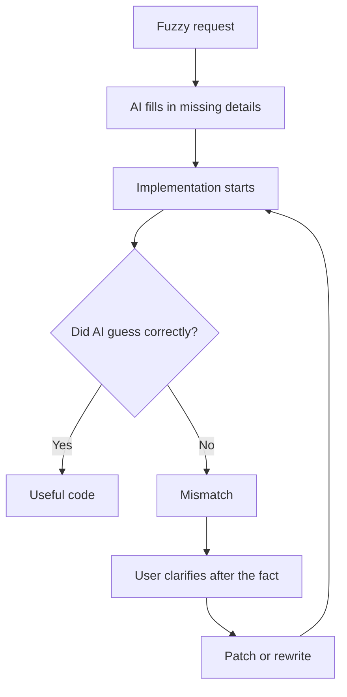

This is the loop OpenSpec tries to shorten. It moves clarification earlier, before code exists.

### 1.2 The OpenSpec Answer

OpenSpec adds a planning and specification layer before implementation.

```text
User idea
   |
   v
Explore meaning
   |
   v
Write proposal
   |
   v
Write behavior specs
   |
   v
Write design
   |
   v
Write tasks
   |
   v
Build from agreed tasks
```

OpenSpec does not replace coding. It improves the instructions that coding starts from.

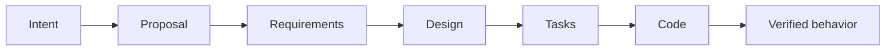

Each step narrows ambiguity. By the time coding starts, the AI has a smaller target to hit.

### 1.3 The Agreement Layer

Think of OpenSpec as an agreement layer between human intent and implementation.

```text
┌────────────────────┐
│ Human intention     │
│ "I want a pipeline" │
└─────────┬──────────┘
          v
┌─────────────────────────────┐
│ OpenSpec agreement layer     │
│ requirements + scenarios     │
│ design + tasks               │
└─────────┬───────────────────┘
          v
┌─────────────────────────────┐
│ Implementation               │
│ code, files, tests, docs      │
└─────────────────────────────┘
```

The agreement layer is where ambiguity is reduced.

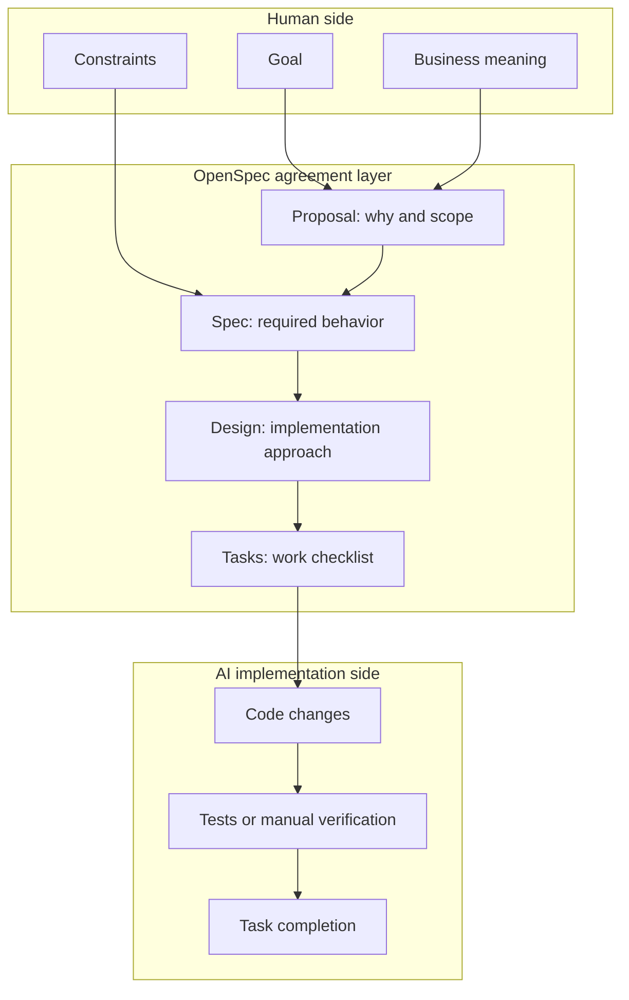

### 1.4 Human vs LLM / Agentic Responsibilities

OpenSpec works best when responsibilities are explicit.

Legend used in this document:

| Label | Meaning |
|---|---|
| Human-owned | The human should decide or approve this. |
| LLM / Agent-owned | The AI can draft, inspect, implement, or update this. |
| Shared | The AI can draft, but the human should review and correct it. |

High-level responsibility split:

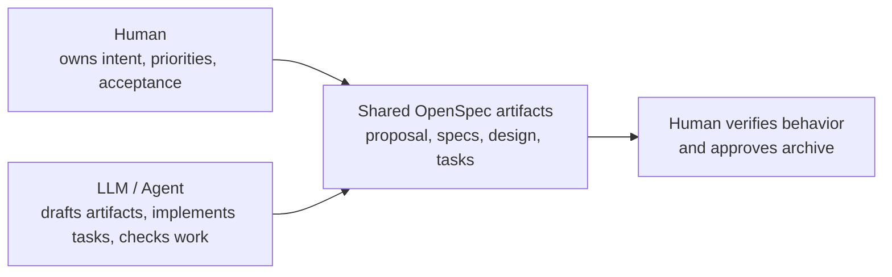

Detailed split:

| Area | Human | LLM / Agentic |
|---|---|---|
| Problem choice | Defines what is worth building | Helps clarify and reframe |
| Requirements | Approves behavior and edge cases | Drafts requirements and scenarios |
| Design | Approves major tradeoffs | Proposes implementation approach |
| Tasks | Confirms scope and folder boundaries | Breaks work into steps |
| Implementation | Reviews result | Writes code and marks tasks complete |
| Verification | Confirms it works for the intended use | Runs checks and reports evidence |
| Archive | Approves that change is complete | Runs or assists archive flow |

Important rule:

> The LLM can draft the agreement, but the human owns the agreement.

For data engineering projects, the human especially owns:

- business meaning of fields
- acceptable data quality rules
- correct aggregation grain
- handling of invalid records
- whether output is useful
- whether the project is ready to archive

## 2. The Core Mental Model

### 2.1 Specs Are Truth

Specs describe how the system behaves now.

They live under:

```text
openspec/specs/
```

If a behavior is already part of the system, the permanent spec should eventually describe it.

Permanent specs should be treated like product memory. They survive after an individual change is finished.

Responsibility:

| Human | LLM / Agentic |
|---|---|
| Decides whether the permanent spec accurately describes the system. | Helps write, update, and merge spec content. |

### 2.2 Changes Are Proposals

A change is one proposed unit of work.

It lives under:

```text
openspec/changes/<change-name>/
```

Example:

```text
openspec/changes/create-sales-etl-pipeline/
```

The change folder contains the proposal, delta specs, design, and tasks.

Responsibility:

| Human | LLM / Agentic |
|---|---|
| Decides the change name, scope, and acceptance criteria. | Creates the change folder and drafts planning artifacts. |

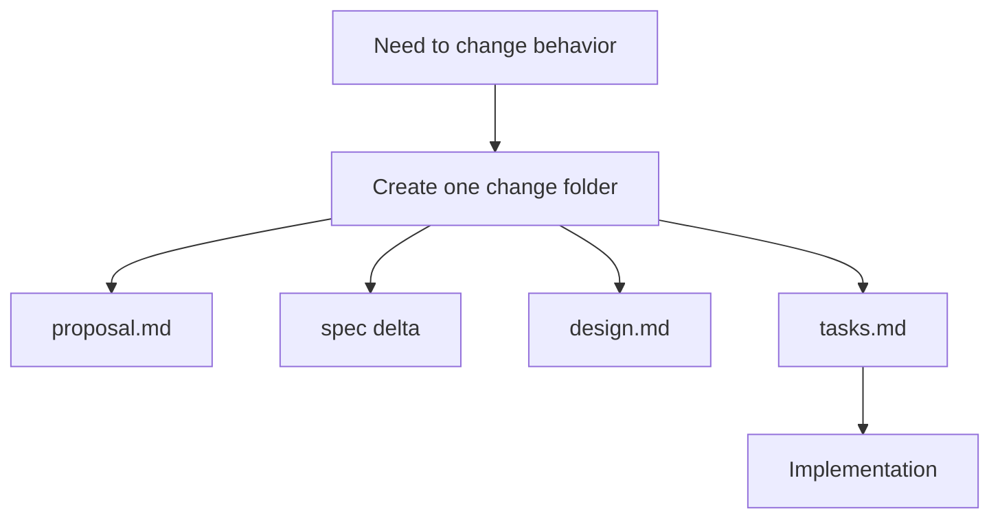

### 2.3 Archive Turns Change Into Truth

When the work is done, archiving applies the delta spec into the permanent specs.

```text
Active change
openspec/changes/create-sales-etl-pipeline/
        |
        | archive
        v
Permanent truth
openspec/specs/sales-etl-pipeline/spec.md
```

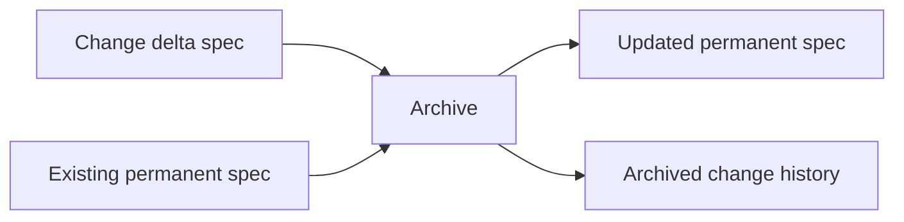

The active change is temporary. The permanent spec is durable.

Responsibility:

| Human | LLM / Agentic |
|---|---|
| Confirms the implementation is complete and worth preserving. | Applies delta specs and moves the completed change to archive. |

## 3. Human In The Loop Theory

Human in the loop means the AI can do work, but the human remains responsible for judgment, approval, and final acceptance.

In OpenSpec, the human is not reviewing every token the AI writes. The human is reviewing the important decision points:

```text
Is this the right problem?
Is this the right behavior?
Is this the right scope?
Is this safe to implement?
Does the result actually work?
Should this become permanent truth?
```

### 3.1 What Human In The Loop Means

Human in the loop is a control model.

The LLM / Agentic system can:

- explore ideas
- draft proposals
- write requirements
- create scenarios
- suggest designs
- create task lists
- implement files
- run checks
- summarize results

The human must:

- provide intent
- validate meaning
- approve behavior
- decide tradeoffs
- catch incorrect assumptions
- verify business correctness
- approve archive

Mermaid view:

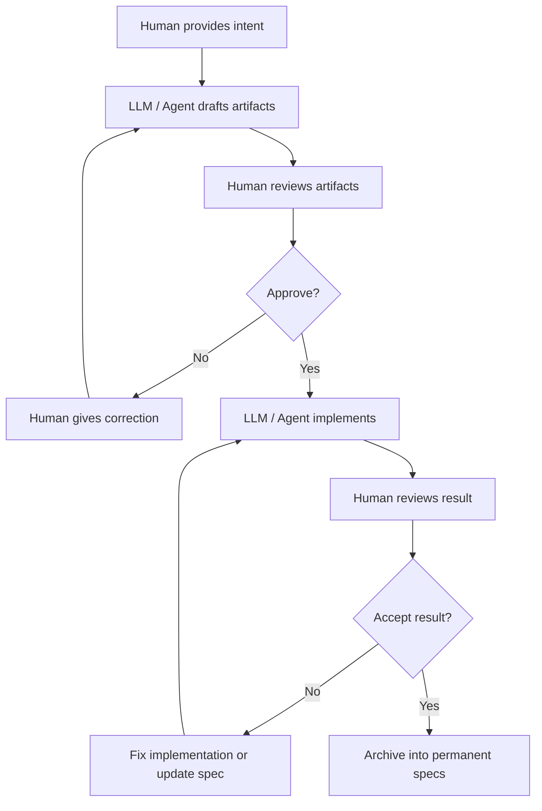

The loop is not a weakness. It is the safety mechanism.

### 3.2 Why Human Review Exists

LLMs are good at generating plausible structure. They are not automatically correct about your business meaning.

For example, in a data engineering project, the LLM may draft:

```text
Aggregate sales by order_date.
```

But the human may know:

```text
The business reports sales by settlement_date, not order_date.
```

That is not a coding detail. That is domain truth. The human must catch it before implementation.

Human review exists because the human owns:

- business meaning
- domain language
- compliance constraints
- acceptable risk
- project priority
- final usefulness

The LLM / Agent owns execution support, not final judgment.

### 3.3 Review And Approval Gates

OpenSpec naturally creates review gates.

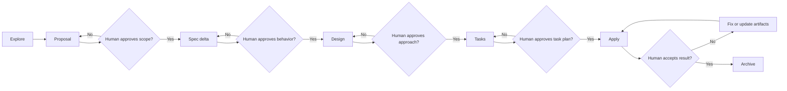

The main approval gates are:

| Gate | Human Reviews | Human Approves |
|---|---|---|
| Proposal review | why, scope, capability, impact | "This is the right change." |
| Spec review | requirements and scenarios | "This is the right behavior." |
| Design review | approach, tradeoffs, risks | "This is an acceptable way to build it." |
| Task review | checklist, folder paths, verification tasks | "This is the right work plan." |
| Apply review | working app/pipeline and completed tasks | "This works." |
| Archive review | final specs and completed behavior | "This should become permanent truth." |

### 3.4 Human Approval Checklist

Use this checklist before allowing the agent to implement:

```text
Proposal approval:
  [ ] Does the proposal solve the right problem?
  [ ] Is the project folder correct?
  [ ] Is the scope small enough?
  [ ] Are non-goals clear?

Spec approval:
  [ ] Are requirements behavior-focused?
  [ ] Are scenarios testable?
  [ ] Are failure cases included?
  [ ] Are business terms correct?

Design approval:
  [ ] Is the technology choice acceptable?
  [ ] Are tradeoffs clear?
  [ ] Are risks named?
  [ ] Is the design simple enough for the project?

Task approval:
  [ ] Do tasks mention the correct folder?
  [ ] Are tasks ordered logically?
  [ ] Are verification tasks included?
  [ ] Is anything missing before implementation?
```

Use this checklist before archiving:

```text
Archive approval:
  [ ] Did the implementation complete all tasks?
  [ ] Did the app or pipeline run successfully?
  [ ] Did verification prove the scenarios?
  [ ] Does the permanent spec describe the final behavior?
  [ ] Is this change truly done?
```

### 3.5 Agentic Work With Human Control

Agentic work means the AI can take multiple steps toward a goal. It may read files, create artifacts, implement code, run checks, and update task status.

Human control means the AI should not silently decide the important things.

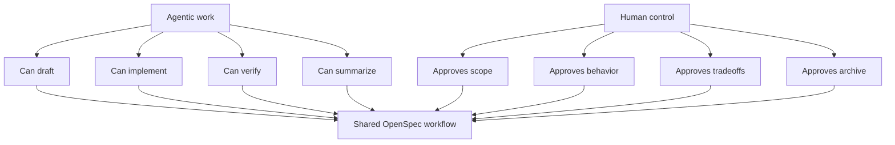

Good pattern:

```text
Agent drafts -> Human reviews -> Agent revises -> Human approves -> Agent implements
```

Risky pattern:

```text
Human gives vague idea -> Agent guesses everything -> Agent implements -> Human discovers mismatch
```

OpenSpec is designed to encourage the good pattern.

### 3.6 Approval Language To Use

Use clear approval language with the agent.

For proposal:

```text
I approve this proposal. Continue to specs/design/tasks.
```

For spec changes:

```text
I approve these requirements and scenarios.
```

For task plan:

```text
I approve this task list. Apply the change.
```

For implementation:

```text
I tested the app/pipeline and it works. Mark verification complete.
```

For archive:

```text
I approve archiving this change.
```

Use correction language when something is wrong:

```text
Do not implement yet. Update the spec so invalid records are quarantined instead of skipped.
```

```text
Update tasks so all implementation files are created inside demos/sales-etl-pipeline.
```

```text
The business grain should be settlement_date, not order_date. Update the proposal, spec, design, and tasks.
```

Human review and approval is how OpenSpec prevents the agent from turning plausible guesses into permanent system behavior.

## 4. The OpenSpec Folder Structure

### 4.1 Permanent Specs

Permanent specs live here:

```text
openspec/specs/
```

Example:

```text
openspec/specs/
  todo-management/
    spec.md
  sales-etl-pipeline/
    spec.md
```

These files answer:

```text
What does the system currently do?
```

### 4.2 Active Changes

Active changes live here:

```text
openspec/changes/
```

Example:

```text
openspec/changes/
  create-tiny-todo-app/
    proposal.md
    design.md
    tasks.md
    specs/
      todo-management/
        spec.md
```

These files answer:

```text
What are we proposing to change?
```

### 4.3 Archived Changes

Archived changes live here:

```text
openspec/changes/archive/
```

Archive is history. Specs are current truth.

Diagram:

```text
┌────────────────────────────────────────────┐
│ openspec/specs/                            │
│ current system truth                       │
└────────────────────────────────────────────┘
                    ▲
                    │ archive completed work
                    │
┌────────────────────────────────────────────┐
│ openspec/changes/                          │
│ active proposed changes                    │
└────────────────────────────────────────────┘
                    │
                    v
┌────────────────────────────────────────────┐
│ openspec/changes/archive/                  │
│ completed change history                   │
└────────────────────────────────────────────┘
```

Mermaid view:

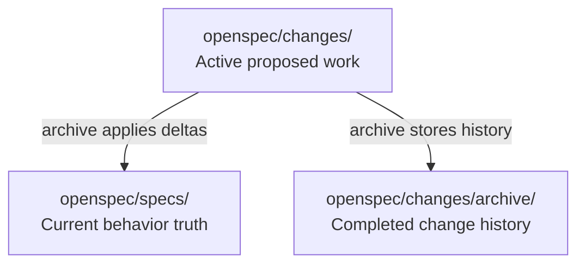

## 5. What Is A Spec?

### 5.1 Spec Means Behavior

A spec describes observable behavior.

Good spec thinking:

```text
What can the user see?
What file gets created?
What output is produced?
What error is shown?
What data is accepted or rejected?
```

### 5.2 Spec Is Not Implementation

A spec should avoid implementation details.

| Spec Behavior | Implementation Detail |
|---|---|
| The system SHALL persist notes after refresh. | Store notes in `localStorage`. |
| The system SHALL reject missing required columns. | Use pandas to inspect columns. |
| The system SHALL write daily sales totals. | Use `groupby()` in Python. |
| The system SHALL allow deleting a todo. | Add a `deleteTodo()` function. |

Behavior belongs in specs. Implementation belongs in design and code.

Responsibility:

| Human | LLM / Agentic |
|---|---|
| Confirms the behavior matches the real need. | Separates behavior from implementation details when drafting. |

### 5.3 Spec Is Testable Agreement

A good spec is something another person can verify.

```text
Spec statement
    |
    v
Scenario
    |
    v
Manual test or automated test
    |
    v
Evidence that behavior works
```

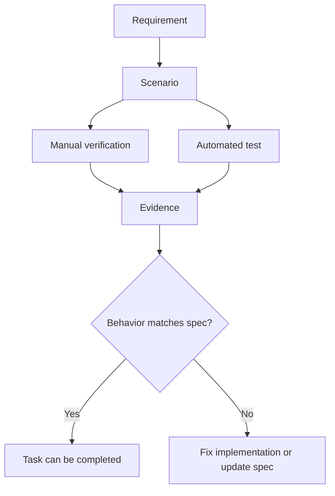

Responsibility:

| Human | LLM / Agentic |
|---|---|
| Decides whether the evidence is acceptable. | Produces checks, tests, screenshots, logs, or summaries as evidence. |

## 6. Requirements

### 6.1 What A Requirement Is

A requirement is one hard promise about system behavior.

Format:

```markdown
### Requirement: <name>
The system SHALL <do one observable thing>.
```

Use `SHALL` or `MUST` for hard requirements.

Responsibility:

| Human | LLM / Agentic |
|---|---|
| Decides which behaviors are mandatory. | Drafts requirement language using `SHALL` or `MUST`. |

### 6.2 Good Requirement Example

```markdown
### Requirement: Validate required columns
The system SHALL reject input files that do not contain all required columns.
```

Why this is good:

- one behavior
- observable
- testable
- uses `SHALL`
- defines rejection behavior

### 6.3 Weak Requirement Example

```markdown
### Requirement: Good validation
The system should validate data well.
```

Why this is weak:

- "good" is subjective
- "well" is vague
- "should" is weaker than `SHALL`
- no failure behavior
- hard to test

### 6.4 Requirement Quality Checklist

```text
┌──────────────────────────────────────────────────────┐
│ Requirement Quality Checklist                        │
├──────────────────────────────────────────────────────┤
│ 1. Is it one behavior?                               │
│ 2. Is it observable?                                 │
│ 3. Is it testable?                                   │
│ 4. Does it use SHALL or MUST?                        │
│ 5. Does it avoid implementation details?             │
│ 6. Does it include failure behavior where needed?    │
│ 7. Does it have at least one scenario?               │
└──────────────────────────────────────────────────────┘
```

Mermaid decision view:

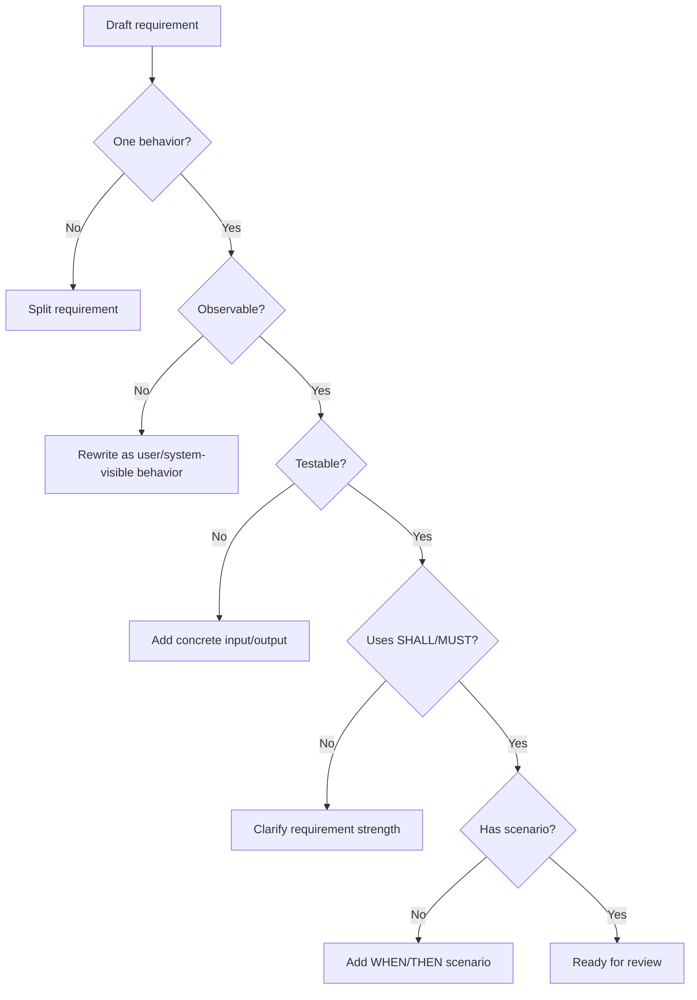

## 7. Scenarios

### 7.1 What A Scenario Is

A scenario is a concrete example that proves a requirement.

Format:

```markdown
#### Scenario: <name>
- **WHEN** <trigger or condition>
- **THEN** <expected result>
```

In OpenSpec, scenario headings should use four hash marks:

```markdown
#### Scenario: Valid file is processed
```

Scenario structure:

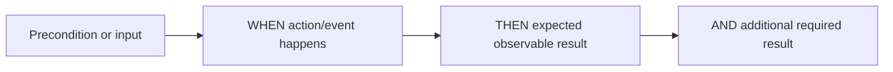

Responsibility:

| Human | LLM / Agentic |
|---|---|
| Provides realistic cases and edge cases. | Converts cases into structured WHEN / THEN scenarios. |

### 7.2 WHEN / THEN Thinking

`WHEN` describes the condition.

`THEN` describes the expected behavior.

Example:

```markdown
### Requirement: Add todo
The system SHALL allow the user to create a todo with non-empty text.

#### Scenario: Add valid todo
- **WHEN** the user submits a todo with non-empty text
- **THEN** the system displays the todo in the todo list
```

### 7.3 Failure Scenarios

Failure scenarios are important because many bugs happen at boundaries.

Example:

```markdown
#### Scenario: Empty todo is submitted
- **WHEN** the user submits empty or whitespace-only todo text
- **THEN** the system does not create a todo
```

For data engineering:

```markdown
#### Scenario: Required column is missing
- **WHEN** a raw CSV file is missing the `order_date` column
- **THEN** the system rejects the file
- **AND** reports that `order_date` is missing
```

## 8. Capabilities

### 8.1 What A Capability Is

A capability is a named area of behavior.

Examples:

```text
notes-management
todo-management
sales-etl-pipeline
schema-validation
daily-sales-aggregation
```

A capability groups related requirements.

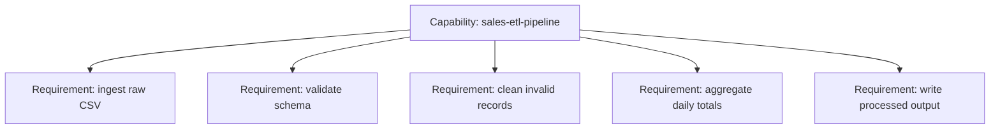

Responsibility:

| Human | LLM / Agentic |
|---|---|
| Confirms the capability name matches the project/domain. | Suggests kebab-case capability names and groups requirements. |

### 8.2 Capability Naming

Use lowercase kebab-case.

Good:

```text
sales-etl-pipeline
customer-deduplication
csv-quality-checker
```

Weak:

```text
app
misc
backend
feature1
```

### 8.3 Capability Examples For Data Engineering

```text
csv-ingestion
schema-validation
invalid-record-handling
daily-kpi-aggregation
parquet-export
pipeline-run-logging
```

## 9. Delta Specs

Delta specs are the difference between current truth and future truth.

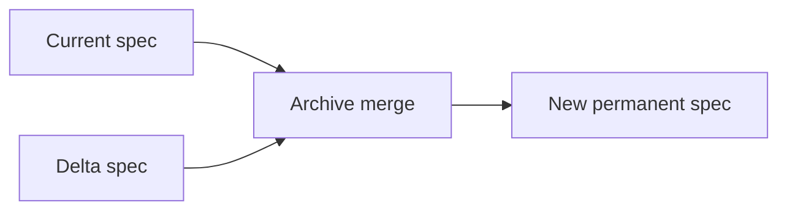

Use the delta operation that matches the kind of behavior change:

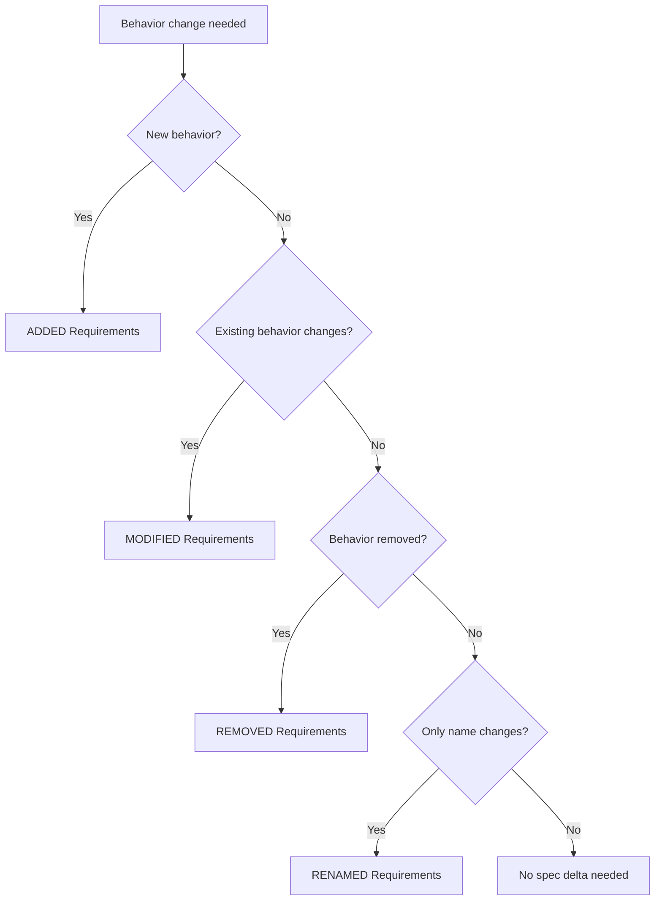

Responsibility:

| Human | LLM / Agentic |
|---|---|
| Confirms whether behavior is added, changed, removed, or renamed. | Chooses the right delta section and drafts the spec update. |

### 9.1 ADDED Requirements

Use `ADDED` when introducing new behavior.

```markdown
## ADDED Requirements

### Requirement: Write processed output
The system SHALL write transformed records to the processed data directory.
```

### 9.2 MODIFIED Requirements

Use `MODIFIED` when changing an existing behavior.

Important: include the full updated requirement, not just the changed sentence.

```markdown
## MODIFIED Requirements

### Requirement: Write processed output
The system SHALL write transformed records to the processed data directory in CSV and Parquet formats.
```

### 9.3 REMOVED Requirements

Use `REMOVED` when deleting behavior.

Include reason and migration.

```markdown
## REMOVED Requirements

### Requirement: Export legacy text report
**Reason**: Replaced by CSV and Parquet outputs.
**Migration**: Use the processed output files instead.
```

### 9.4 RENAMED Requirements

Use `RENAMED` only when the behavior is the same and only the name changes.

```markdown
## RENAMED Requirements

FROM: `Daily report output`
TO: `Daily sales totals output`
```

## 10. OpenSpec Artifacts

The artifacts are separate because each answers a different question.

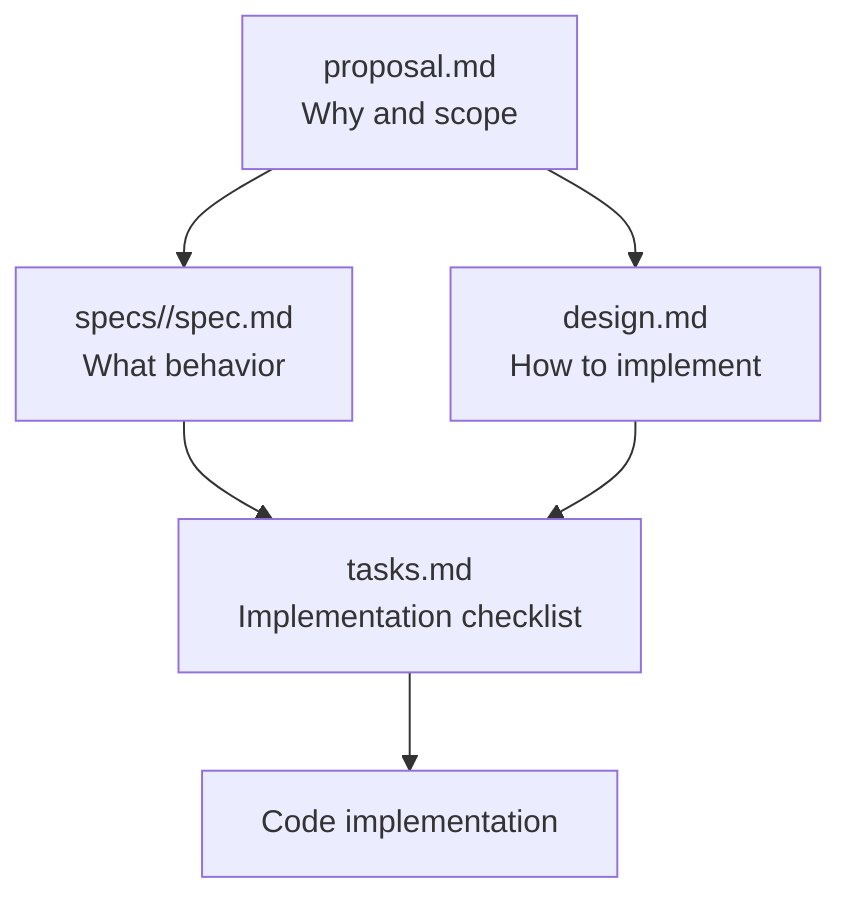

Another way to remember it:

```text
proposal = why
spec     = what
design   = how
tasks    = steps
code     = result
```

Responsibility:

| Artifact | Human | LLM / Agentic |
|---|---|---|
| `proposal.md` | Approves purpose and scope | Drafts why, changes, capabilities, impact |
| `spec.md` | Approves behavior contract | Drafts requirements and scenarios |
| `design.md` | Approves technical tradeoffs | Proposes architecture and approach |
| `tasks.md` | Checks task order and folder boundaries | Creates implementation checklist |
| code | Reviews and tests result | Implements from tasks |

### 10.1 `proposal.md`

Purpose:

```text
Why are we doing this, and what is in scope?
```

Typical sections:

```markdown
## Why

## What Changes

## Capabilities

## Impact
```

### 10.2 `specs/<capability>/spec.md`

Purpose:

```text
What behavior must the system provide?
```

Example:

```markdown
## Purpose

Provides local batch processing for raw sales CSV files.

## ADDED Requirements

### Requirement: Ingest raw sales CSV
The system SHALL read raw sales CSV files from the raw data directory.

#### Scenario: Raw file exists
- **WHEN** a raw sales CSV file exists
- **THEN** the system reads it for processing
```

### 10.3 `design.md`

Purpose:

```text
How will we satisfy the spec?
```

Design includes:

- architecture
- technology choices
- file layout
- data model
- tradeoffs
- risks

Example:

```markdown
## Decisions

### Use Python and CSV files

Use Python for the local batch pipeline because it is beginner-friendly and easy to run locally.

Alternative considered: Spark. Spark is unnecessary for the demo scale.
```

### 10.4 `tasks.md`

Purpose:

```text
What steps will implement the change?
```

Example:

```markdown
## 1. Project Structure

- [ ] 1.1 Create files inside `demos/sales-etl-pipeline`.
- [ ] 1.2 Add sample raw CSV data.

## 2. Pipeline Behavior

- [ ] 2.1 Implement CSV ingestion.
- [ ] 2.2 Validate required columns.
- [ ] 2.3 Write processed output.
```

## 11. Terminal Commands vs Chat Commands

### 11.1 Terminal Commands

These run in the terminal:

```bash
openspec init
openspec list
openspec status --change create-sales-etl-pipeline
openspec validate create-sales-etl-pipeline --strict
openspec archive create-sales-etl-pipeline
```

Terminal commands are for setup, status, validation, and archive operations.

### 11.2 Codex Chat Commands

These run in Codex chat:

```text
$openspec-explore
$openspec-propose create-sales-etl-pipeline
$openspec-apply-change create-sales-etl-pipeline
$openspec-archive-change create-sales-etl-pipeline
```

Do not type `$openspec-*` commands in the terminal.

Diagram:

```text
┌──────────────────────────────┐       ┌──────────────────────────────┐
│ Terminal                      │       │ Codex Chat                    │
├──────────────────────────────┤       ├──────────────────────────────┤
│ openspec list                 │       │ $openspec-explore             │
│ openspec status               │       │ $openspec-propose             │
│ openspec validate             │       │ $openspec-apply-change        │
│ openspec archive              │       │ $openspec-archive-change      │
└──────────────────────────────┘       └──────────────────────────────┘
```

Mermaid view:

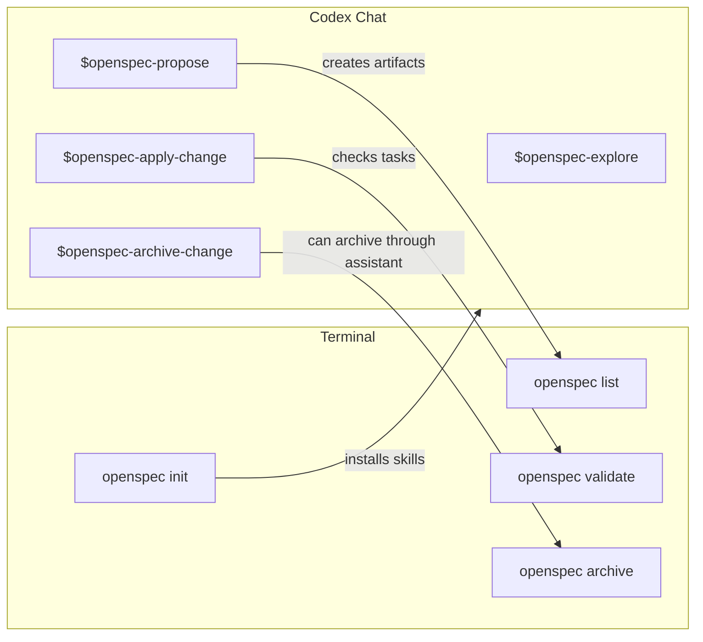

## 12. The Full OpenSpec Lifecycle

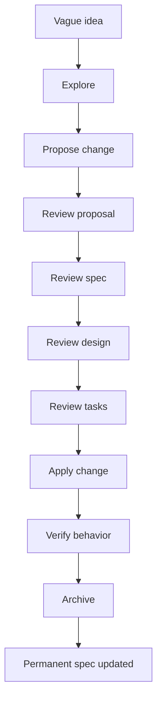

Lifecycle with responsibility:

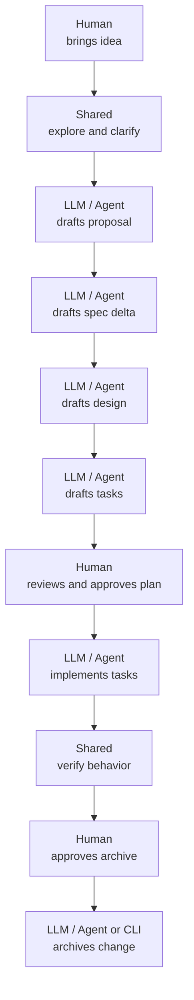

State-machine view:

```mermaid
stateDiagram-v2
    [*] --> Idea
    Idea --> Exploring
    Exploring --> Proposed
    Proposed --> Reviewed
    Reviewed --> Applying
    Applying --> Verified
    Verified --> Archived
    Archived --> [*]

    Proposed --> Exploring: unclear requirement
    Applying --> Proposed: design/spec update needed
    Verified --> Applying: verification failed
```

Sequence view:

```mermaid
sequenceDiagram
    participant User
    participant Codex
    participant OpenSpec
    participant Codebase

    User->>Codex: $openspec-propose create-feature
    Codex->>OpenSpec: create change artifacts
    OpenSpec-->>Codex: proposal, specs, design, tasks
    User->>Codex: review and adjust artifacts
    User->>Codex: $openspec-apply-change create-feature
    Codex->>Codebase: implement tasks
    Codex->>OpenSpec: mark tasks complete
    User->>OpenSpec: archive completed change
    OpenSpec->>OpenSpec: merge delta specs into permanent specs
```

### 12.1 Explore

Use explore when the idea is still fuzzy.

```text
$openspec-explore
```

Explore mode is thinking mode. It should clarify requirements before implementation.

Responsibility:

| Human | LLM / Agentic |
|---|---|
| Brings the idea, constraints, and context. | Asks clarifying questions, compares options, surfaces risks. |

### 12.2 Propose

Use propose when the change is clear enough to plan.

```text
$openspec-propose create-sales-etl-pipeline
```

This creates the proposal, spec delta, design, and tasks.

Responsibility:

| Human | LLM / Agentic |
|---|---|
| Provides the change intent and project location. | Creates the OpenSpec artifacts. |

### 12.3 Review

Review before coding.

Read:

```text
proposal.md
specs/<capability>/spec.md
design.md
tasks.md
```

Especially check that `tasks.md` names the right project folder.

Responsibility:

| Human | LLM / Agentic |
|---|---|
| Reviews correctness and says what is wrong or missing. | Updates artifacts when the review finds gaps. |

### 12.4 Apply

Apply builds from the task list.

```text
$openspec-apply-change create-sales-etl-pipeline
```

The AI should complete tasks and mark them checked.

Responsibility:

| Human | LLM / Agentic |
|---|---|
| Observes whether the result matches the intended use. | Implements tasks, updates files, marks checklist items complete. |

### 12.5 Archive

Archive after implementation and verification.

```bash
openspec archive create-sales-etl-pipeline
```

Archive updates permanent specs and moves the change to history.

Responsibility:

| Human | LLM / Agentic |
|---|---|
| Decides the change is complete enough to archive. | Runs archive or guides the terminal command. |

### 12.6 Responsibility Matrix

Use this as the simple operating model.

| Lifecycle Step | Human Role | LLM / Agentic Role | Output |
|---|---|---|---|
| Explore | Explain goal and constraints | Clarify, map options, identify risks | clearer idea |
| Propose | Approve scope | Draft artifacts | change folder |
| Review spec | Validate behavior | Refine requirements and scenarios | behavior contract |
| Review design | Approve tradeoffs | Propose implementation approach | design agreement |
| Review tasks | Check project path and scope | Create ordered checklist | task list |
| Apply | Monitor result | Implement and check off tasks | working code |
| Verify | Decide if it works | Run checks and summarize evidence | confidence |
| Archive | Approve finalization | Merge deltas into permanent specs | updated source of truth |

```mermaid
flowchart LR
    H["Human judgment"] --> A["OpenSpec artifacts"]
    L["LLM / Agent execution"] --> A
    A --> C["Code"]
    C --> V["Verification"]
    V --> H
```

## 13. Data Engineering Example

### 13.1 Idea

```text
Build a local sales ETL pipeline.
```

This is too vague for implementation. We need capability, requirements, and scenarios.

### 13.2 Capability

```text
sales-etl-pipeline
```

This capability covers ingesting, validating, transforming, and writing sales data.

### 13.3 Requirements

Possible requirements:

```markdown
### Requirement: Ingest raw sales CSV
The system SHALL read raw sales CSV files from the raw data directory.

#### Scenario: Raw sales file exists
- **WHEN** a raw sales CSV file exists in the raw data directory
- **THEN** the system reads it for processing

### Requirement: Validate required columns
The system SHALL reject raw sales files missing required columns.

#### Scenario: Required column is missing
- **WHEN** a raw sales CSV file is missing `order_date`
- **THEN** the system rejects the file
- **AND** reports that `order_date` is missing

### Requirement: Write daily sales totals
The system SHALL write daily sales totals to the processed data directory.

#### Scenario: Valid file is processed
- **WHEN** the system processes a valid raw sales CSV file
- **THEN** it writes a daily sales totals file
```

### 13.4 Pipeline Diagram

```text
data/raw/sales.csv
       |
       v
┌──────────────────┐
│ 1. Ingest CSV     │
└────────┬─────────┘
         v
┌──────────────────┐
│ 2. Validate       │
│ required columns  │
└────────┬─────────┘
         v
┌──────────────────┐
│ 3. Clean records  │
└────────┬─────────┘
         v
┌──────────────────┐
│ 4. Aggregate      │
│ daily totals      │
└────────┬─────────┘
         v
data/processed/daily_sales.csv
```

Mermaid pipeline:

```mermaid
flowchart LR
    A["data/raw/sales.csv"] --> B["Ingest CSV"]
    B --> C{"Required columns present?"}
    C -- "No" --> D["Reject file<br/>Report missing columns"]
    C -- "Yes" --> E["Clean records"]
    E --> F{"Valid records remain?"}
    F -- "No" --> G["Write empty/summary result<br/>Report no valid records"]
    F -- "Yes" --> H["Aggregate by order_date"]
    H --> I["Write daily_sales.csv"]
    I --> J["data/processed/"]
```

Data engineering projects especially benefit from specs because the expected behavior is often hidden in data assumptions. OpenSpec makes those assumptions visible:

- where input files are found
- what columns are required
- what makes a record invalid
- whether invalid rows are rejected, skipped, or quarantined
- what output files are created
- how reruns should behave
- what success or failure looks like

Responsibility:

| Human | LLM / Agentic |
|---|---|
| Defines business rules such as valid fields, correct grain, and acceptable outputs. | Converts rules into requirements, scenarios, pipeline code, and verification steps. |

### 13.5 Data Contract Thinking

A data engineering spec often acts like a lightweight data contract.

```mermaid
flowchart TD
    A["Input contract"] --> B["Pipeline behavior"]
    B --> C["Output contract"]

    A1["File location"] --> A
    A2["Required columns"] --> A
    A3["Data types"] --> A
    A4["Valid value rules"] --> A

    C1["Output location"] --> C
    C2["Output schema"] --> C
    C3["Aggregation grain"] --> C
    C4["Error/reporting behavior"] --> C
```

For a sales ETL pipeline, the contract could be:

| Contract Area | Example |
|---|---|
| Input folder | `data/raw/` |
| Required columns | `order_id`, `order_date`, `customer_id`, `amount` |
| Invalid record rule | rows with missing or non-numeric `amount` are invalid |
| Output folder | `data/processed/` |
| Output grain | one row per `order_date` |
| Output metric | total sales amount |

Human-owned decisions:

- Which columns are required?
- What does `amount` mean?
- Are refunds negative amounts or separate records?
- Should bad records stop the pipeline or be quarantined?
- Is output grain daily, monthly, customer-level, or product-level?
- What counts as a successful run?

LLM / Agentic work:

- Draft the requirements.
- Generate sample data.
- Create the project folder structure.
- Implement the pipeline.
- Write tests or verification commands.
- Summarize failures and outputs.

Turning this into requirements:

```markdown
### Requirement: Validate sales input schema
The system SHALL reject raw sales files missing any required column.

#### Scenario: Amount column is missing
- **WHEN** a raw sales CSV file does not include `amount`
- **THEN** the system rejects the file
- **AND** reports that `amount` is missing

### Requirement: Aggregate daily sales
The system SHALL calculate total sales amount for each order date.

#### Scenario: Multiple orders exist for one date
- **WHEN** multiple valid orders have the same `order_date`
- **THEN** the processed output contains one row for that date
- **AND** the row contains the sum of those order amounts
```

## 14. Common Beginner Mistakes

### 14.1 Writing Code Details In Specs

Weak:

```markdown
The system SHALL use pandas groupby to calculate daily totals.
```

Better:

```markdown
The system SHALL calculate total sales for each order date.
```

Pandas is implementation. Daily totals are behavior.

### 14.2 Making Requirements Too Broad

Weak:

```markdown
The system SHALL ingest files, validate rows, clean data, aggregate totals, write output, and log errors.
```

Better:

```markdown
### Requirement: Ingest files
...

### Requirement: Validate rows
...

### Requirement: Write output
...
```

One requirement should cover one behavior.

### 14.3 Forgetting Failure Behavior

Weak:

```markdown
The system SHALL process CSV files.
```

Better:

```markdown
The system SHALL reject CSV files missing required columns.
```

Failure behavior is part of the real contract.

### 14.4 Typing Chat Commands In Terminal

Wrong in terminal:

```bash
$openspec-propose create-sales-etl-pipeline
```

Right in Codex chat:

```text
$openspec-propose create-sales-etl-pipeline
```

## 15. Learning Path

Use this order:

```text
Level 1: Understand behavior vs implementation
   |
   v
Level 2: Write one clear requirement
   |
   v
Level 3: Add scenarios
   |
   v
Level 4: Group requirements into capabilities
   |
   v
Level 5: Create proposal
   |
   v
Level 6: Review design and tasks
   |
   v
Level 7: Apply implementation
   |
   v
Level 8: Archive into permanent specs
```

We will learn this step by step. Do not rush to implementation. The foundation skill is learning to express behavior clearly.

Mermaid view:

```mermaid
flowchart TD
    L1["Level 1<br/>Behavior vs implementation"] --> L2["Level 2<br/>One clear requirement"]
    L2 --> L3["Level 3<br/>Scenarios"]
    L3 --> L4["Level 4<br/>Capabilities"]
    L4 --> L5["Level 5<br/>Proposal"]
    L5 --> L6["Level 6<br/>Design and tasks"]
    L6 --> L7["Level 7<br/>Apply implementation"]
    L7 --> L8["Level 8<br/>Archive"]
```

## 16. Mermaid Diagram Reference

Use these diagram types while learning OpenSpec:

| Diagram Type | Best For | Example In This File |
|---|---|---|
| `flowchart TD` | step-by-step concept flow | lifecycle and requirement quality |
| `flowchart LR` | left-to-right data movement | pipeline and artifact dependency |
| `stateDiagram-v2` | change lifecycle states | idea to archive |
| `sequenceDiagram` | interactions between user, Codex, OpenSpec, codebase | propose/apply/archive sequence |

Simple Mermaid template for an OpenSpec change:

```mermaid
flowchart TD
    A["Idea"] --> B["Proposal"]
    B --> C["Spec delta"]
    C --> D["Design"]
    D --> E["Tasks"]
    E --> F["Implementation"]
    F --> G["Verification"]
    G --> H["Archive"]
```

Simple Mermaid template for a data engineering pipeline:

```mermaid
flowchart LR
    A["Raw data"] --> B["Ingest"]
    B --> C["Validate"]
    C --> D["Transform"]
    D --> E["Write processed data"]
    E --> F["Verify output"]
```

## 17. Sources

- OpenSpec Documentation: https://openspec.dev/docs
- Core Concepts: https://openspec.dev/docs/overview
- How Commands Work: https://openspec.dev/docs/how-commands-work
- OPSX Workflow: https://openspec.dev/docs/opsx
- Writing Good Specs: https://openspec.dev/docs/writing-specs
