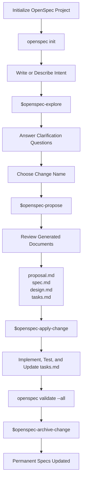

# OpenSpec Commands Reference

This file lists the OpenSpec chat commands installed in this workspace, their purpose, and simple examples.

These commands are used in Codex chat, not in the terminal.

## Lifecycle Diagram



## Lifecycle Order

Typical flow:

```text
1. $openspec-explore
2. $openspec-propose <change-name>
3. $openspec-update-change <change-name>   optional
4. $openspec-apply-change <change-name>
5. $openspec-sync-specs                    optional
6. $openspec-archive-change <change-name>
```

`<change-name>` is a name chosen for one unit of work. It can be anything meaningful, but it should usually be lowercase kebab-case.

Good examples:

```text
create-csv-spark-sql-transform
add-customer-email-validation
fix-output-column-order
create-sales-etl-pipeline
```

Avoid vague names:

```text
change1
stuff
update
new-feature
```

The change name becomes the folder name under:

```text
openspec/changes/<change-name>/
```

## Command Summary

```text
$openspec-explore
$openspec-propose
$openspec-update-change
$openspec-apply-change
$openspec-sync-specs
$openspec-archive-change
```

## Commands Summary Table

| Command | Purpose | When To Use | Files Generated/Updated | Example |
|---|---|---|---|---|
| `$openspec-explore` | Clarify an unclear idea before creating formal OpenSpec files. | Use at the beginning when the intent is incomplete or fuzzy. | Usually no required files. May read `INTENT.md` or other context files. In some agent flows, it may produce clarification notes or accidental draft files if asked too broadly. | `$openspec-explore` |
| `$openspec-propose` | Create a new OpenSpec change package. | Use after the idea is clear enough to generate proposal, spec, design, and tasks. | `openspec/changes/<change-name>/proposal.md`, `openspec/changes/<change-name>/design.md`, `openspec/changes/<change-name>/tasks.md`, `openspec/changes/<change-name>/specs/<capability>/spec.md` | `$openspec-propose create-csv-spark-sql-transform` |
| `$openspec-update-change` | Revise an existing OpenSpec change. | Use when requirements, design, specs, or tasks need correction before or during implementation. | Updates existing files under `openspec/changes/<change-name>/`, commonly `proposal.md`, `design.md`, `tasks.md`, and `specs/<capability>/spec.md`. | `$openspec-update-change create-csv-spark-sql-transform` |
| `$openspec-apply-change` | Implement an existing OpenSpec change by working through `tasks.md`. | Use when the planning documents are ready and you want Codex to build the solution. | Updates project implementation files, test files, docs, and `openspec/changes/<change-name>/tasks.md` checkboxes. For this project: `README.md`, `requirements.txt`, `data/raw/sample_customers.csv`, `src/config.py`, `src/pipeline.py`, `src/utils.py`, `tests/test_pipeline.py`, `IMPLEMENTATION_LOG.md`. | `$openspec-apply-change create-csv-spark-sql-transform` |
| `$openspec-sync-specs` | Reconcile specs/instructions with the current workspace state. | Use when files were manually edited or specs may be out of alignment. | May update or report on files under `openspec/specs/` and active change specs, depending on what is out of sync. | `$openspec-sync-specs` |
| `$openspec-archive-change` | Finish a completed change and update permanent specs. | Use after implementation is complete, verified, and ready to become official project behavior. | Moves the active change into `openspec/changes/archive/<date>-<change-name>/` and updates permanent specs under `openspec/specs/`. | `$openspec-archive-change create-csv-spark-sql-transform` |

## `$openspec-explore`

Purpose:

Use this when the idea is unclear or incomplete. The LLM reads the available intent/context and asks clarification questions before creating OpenSpec proposal files.

Example:

```text
$openspec-explore

Read demos/csv-spark-sql-transform/INTENT.md.

I want to build this data engineering solution. Before creating the OpenSpec proposal, ask me the missing clarification questions.
```

## `$openspec-propose`

Purpose:

Use this to create a new OpenSpec change. It generates the planning artifacts for the change, usually including `proposal.md`, `design.md`, `tasks.md`, and one or more spec files.

Example:

```text
$openspec-propose create-csv-spark-sql-transform

Build a local data engineering pipeline that reads a CSV file, transforms it with PySpark and Spark SQL by dropping selected fields, and writes the result as CSV.
```

Expected output files:

```text
openspec/changes/create-csv-spark-sql-transform/
  proposal.md
  design.md
  tasks.md
  specs/
```

## `$openspec-update-change`

Purpose:

Use this when an existing OpenSpec change needs to be revised before or during implementation. This is useful when requirements change, clarification reveals missing behavior, or the generated artifacts need correction.

Example:

```text
$openspec-update-change create-csv-spark-sql-transform

Update the change so the implementation uses PySpark with Spark SQL by creating a temporary view and running a SQL SELECT statement.
```

## `$openspec-apply-change`

Purpose:

Use this to implement an existing OpenSpec change. The LLM reads the proposal, specs, design, and tasks, then works through `tasks.md` step by step.

Example:

```text
$openspec-apply-change create-csv-spark-sql-transform

Implement the project step by step. After each successful implementation step, update demos/csv-spark-sql-transform/IMPLEMENTATION_LOG.md with what was done.
```

## `$openspec-sync-specs`

Purpose:

Use this to sync or refresh OpenSpec specs/instructions when the project state needs alignment. This is helpful when files were manually edited or the assistant needs to reconcile current specs with the workspace.

Example:

```text
$openspec-sync-specs

Review the current OpenSpec specs and changes, then report whether anything needs to be synchronized.
```

## `$openspec-archive-change`

Purpose:

Use this after implementation is complete and verified. Archiving moves the completed change into history and updates the permanent specs so the proposed behavior becomes the official system truth.

Example:

```text
$openspec-archive-change create-csv-spark-sql-transform

Archive this completed change after confirming the tasks are complete and validation passes.
```

## Terminal Commands Versus Chat Commands

OpenSpec has two command surfaces.

Terminal commands run in the shell:

```bash
openspec list
openspec validate --all
openspec status --change create-csv-spark-sql-transform
```

Chat commands run in Codex chat:

```text
$openspec-explore
$openspec-propose create-csv-spark-sql-transform
$openspec-apply-change create-csv-spark-sql-transform
```

Do not type `$openspec-*` commands in the terminal. They are meant for the AI assistant chat.

# OpenSpec Generated Documents Reference

OpenSpec creates a set of planning documents for each change. These documents live under:

```text
openspec/changes/<change-name>/
```

For this project, the change folder is:

```text
openspec/changes/create-csv-spark-sql-transform/
```

## Document Summary

```text
proposal.md
design.md
tasks.md
specs/<capability>/spec.md
```

For this project:

```text
openspec/changes/create-csv-spark-sql-transform/
  proposal.md
  design.md
  tasks.md
  specs/csv-spark-transform-spec.md
```

## `proposal.md`

Description:

The proposal explains why the change exists and what the project should accomplish. It captures the business or learning intent, the scope, the new capability, and the expected impact.

Use it to answer:

- Why are we doing this?
- What is changing?
- What is in scope?
- What is out of scope?
- What capability is being added or modified?

Example:

```markdown
## Why

Build a small data engineering demo to learn how OpenSpec can guide a PySpark implementation from intent through specification, design, tasks, and verification.

## What Changes

- Add a local PySpark pipeline that reads customer CSV data.
- Use Spark SQL to select the output columns.
- Drop `phone`, `address`, and `internal_notes`.
- Write the transformed result as CSV.

## Impact

- Adds a runnable local data engineering demo.
- Does not add scheduling, cloud storage, databases, or streaming.
```

## `specs/<capability>/spec.md`

Description:

The spec file defines the required behavior. It should focus on what the system must do, not how the code will be written.

Specs usually use requirements and scenarios. Requirements describe behavior. Scenarios describe concrete examples of that behavior.

Use it to answer:

- What must the system do?
- What should happen when the user runs the pipeline?
- What output should be produced?
- What behavior proves the requirement is satisfied?

Example:

```markdown
## ADDED Requirements

### Requirement: Transform customer CSV with Spark SQL

The system SHALL transform customer CSV data using Spark SQL and write the selected columns to a CSV output.

#### Scenario: Drop selected fields

- **WHEN** the pipeline processes the source customer CSV
- **THEN** the output excludes `phone`, `address`, and `internal_notes`
- **AND** the output includes `customer_id`, `customer_name`, `email`, `signup_date`, and `status`
```

## `design.md`

Description:

The design explains the technical approach. This is where implementation decisions belong.

Use it to answer:

- Which language or framework will be used?
- How will data be read?
- How will Spark SQL be used?
- Where will output be written?
- How will errors be handled?
- How will the project be verified?

Example:

```markdown
## Context

The project is a local learning demo for a CSV-to-CSV data engineering pipeline.

## Decisions

### Use PySpark

The pipeline will use PySpark so the implementation can be written in Python while still using Spark execution.

### Use Spark SQL for transformation

The script will read the CSV into a DataFrame, register it as a temporary view, and run a SQL `SELECT` statement to keep only the required columns.

Example transformation:

```sql
SELECT
  customer_id,
  customer_name,
  email,
  signup_date,
  status
FROM customers
```

### Fail fast on errors

The first version will stop on missing files, malformed input, or processing errors.
```

## `tasks.md`

Description:

The tasks file is the implementation checklist. During `$openspec-apply-change`, the LLM works through this file step by step and marks completed items.

Use it to answer:

- What needs to be built?
- What order should implementation follow?
- What verification steps are required?
- What work is complete or still pending?

Example:

```markdown
## 1. Project Setup

- [ ] 1.1 Create sample customer CSV data.
- [ ] 1.2 Add README instructions for running the project.

## 2. Pipeline Implementation

- [ ] 2.1 Create the PySpark transform script.
- [ ] 2.2 Read the source CSV with headers.
- [ ] 2.3 Register the input DataFrame as a Spark SQL temporary view.
- [ ] 2.4 Run a Spark SQL query that keeps only the required columns.
- [ ] 2.5 Write the transformed data as CSV.

## 3. Verification

- [ ] 3.1 Verify the output CSV includes the kept fields.
- [ ] 3.2 Verify the output CSV excludes the dropped fields.
- [ ] 3.3 Verify the project can be run locally.
```

## `.openspec.yaml`

Description:

Some OpenSpec change folders include a hidden `.openspec.yaml` file. This file stores OpenSpec metadata for the change. It is used by the OpenSpec CLI and assistant workflow.

Most learners do not need to edit this file directly.

Example:

```yaml
schema: spec-driven
```

## Permanent Specs

After a change is complete and archived, OpenSpec updates the permanent specs under:

```text
openspec/specs/
```

Description:

Permanent specs describe the behavior that is now officially part of the project. A change spec under `openspec/changes/.../specs/` is temporary while a change is active. After archive, the accepted behavior becomes part of `openspec/specs/`.

Example:

```text
openspec/specs/csv-spark-transform/spec.md
```

## Active Change Documents Versus Permanent Specs

```text
openspec/changes/<change-name>/
```

Temporary planning documents for proposed or active work.

```text
openspec/specs/
```

Permanent behavior documents for completed and archived work.

Mental model:

```text
Active change docs = proposed behavior
Permanent specs    = accepted behavior
Archive            = converts proposed behavior into accepted behavior
```
