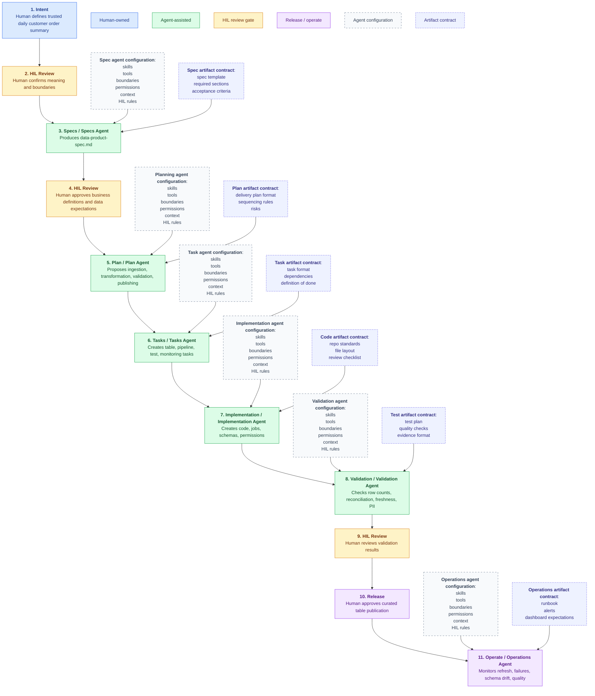

# Spec Development Methodology

## Index

0. [Data Engineering Project Flow](#data-engineering-project-flow)
1. [Step 1: Intent](#step-1-intent)
2. [Step 2: HIL Review](#step-2-hil-review)
3. [Step 3: Specs / Specs Agent](#step-3-specs--specs-agent)
4. Step 4: HIL Review
5. Step 5: Plan / Plan Agent
6. Step 6: Tasks / Tasks Agent
7. Step 7: Implementation / Implementation Agent
8. Step 8: Validation / Validation Agent
9. Step 9: HIL Review
10. Step 10: Release
11. Step 11: Operate / Operations Agent

This document covers **Step 1: Intent**. The later steps will be developed in sequence.

## Data Engineering Project Flow

For a data engineering project, the flow usually looks like this:



The same idea can be summarized as:

```text
1. Human Intent -> 2. HIL Review -> 3. Specs Agent -> 4. HIL Review -> 5. Plan Agent -> 6. Tasks Agent -> 7. Implementation Agent -> 8. Validation Agent -> 9. HIL Review -> 10. Release -> 11. Operations Agent
```

Each stage answers a different question:

| Step | Stage | Main Question | Output |
|---|---|---|---|
| 1 | Intent | What outcome do we need, and why? | Human-owned intent document |
| 2 | HIL Review | Is the meaning correct before moving forward? | Human approval or correction |
| 3 | Specs | What exactly must be true? | Agent-drafted, human-reviewed data specification |
| 4 | HIL Review | Are the business definitions and data expectations correct? | Human approval or correction |
| 5 | Plan | How should we approach the data engineering work? | Agent-proposed delivery plan and sequencing |
| 6 | Tasks | What concrete work must be done? | Agent-generated backlog items or implementation tasks |
| 7 | Implementation | How is it built? | Agent-assisted code, jobs, schemas, permissions, data assets |
| 8 | Validation | How do we prove the data is correct and safe? | Agent-run checks, reconciliations, freshness checks, PII checks |
| 9 | HIL Review | Are the validation results acceptable? | Human approval or correction |
| 10 | Release | How does it become available? | Human-approved publication, deployment, access enablement |
| 11 | Operate | How do we keep it trustworthy? | Agent monitoring, human decisions, follow-up changes |

Before an agent operates, it needs configuration. Do not treat agent configuration as one common setup for every step. Each agent role should have its own configuration because the skills, tools, permissions, and boundaries are different.

| Configuration Area | What Must Be Defined |
|---|---|
| Skills | The agent capabilities needed for the work, such as data engineering, SQL, PySpark, orchestration, data quality, governance, documentation, testing, and observability. |
| Tools | The systems the agent can use, such as code repositories, notebooks, warehouse connections, data catalogs, orchestration tools, ticketing systems, and monitoring tools. |
| Boundaries | What the agent may and may not do, including no production changes, no schema changes, no access changes, no destructive operations, or no business-rule invention without approval. |
| Permissions | Read and write access for files, repositories, databases, environments, secrets, deployment systems, and monitoring systems. |
| Context | Project intent, approved specs, source details, schemas, data contracts, business definitions, platform standards, naming conventions, and previous decisions. |
| HIL Rules | The points where a human must approve, such as intent approval, spec approval, production deployment, access changes, data deletion, and validation signoff. |
| Quality Gates | Required checks before moving forward, such as tests, reconciliation, freshness, row counts, schema checks, PII checks, lineage checks, and peer review. |
| Escalation Rules | When the agent must stop and ask for human help, such as unclear business meaning, missing source ownership, failed validation, privacy risk, or production-impacting changes. |

Each agent also needs an artifact contract.

An artifact contract tells the agent what to produce, how to structure it, what inputs to use, and how the output will be judged. Without an artifact contract, the agent may understand the topic but still produce the wrong shape of work.

| Agent Role | Artifact Produced | Artifact Contract Defines |
|---|---|---|
| Spec agent | Data specification | Spec template, required sections, source-to-target mapping expectations, business rule format, validation rule format, open-question format |
| Planning agent | Delivery plan or design plan | Plan structure, sequencing rules, dependencies, assumptions, risks, milestones, HIL checkpoints |
| Task agent | Implementation tasks | Task format, task size, dependencies, owners, acceptance criteria, definition of done |
| Implementation agent | Code, config, schemas, jobs | Repository standards, file layout, coding conventions, naming rules, review checklist, allowed changes |
| Validation agent | Test plan, test code, validation evidence | Test types, reconciliation checks, data quality checks, evidence format, pass/fail criteria |
| Operations agent | Runbook, monitors, alerts, dashboard notes | Operational checks, alert rules, ownership, escalation path, SLA/SLO expectations |

An artifact contract should usually answer:

- What artifact should be produced?
- What template or structure must be followed?
- What source inputs must be used?
- What must not be invented?
- What format should the output use?
- What acceptance criteria must be satisfied?
- What evidence must be attached?
- What requires HIL approval before moving forward?

These configuration areas should live in separate documents for each agent or agent role.

Example agent configuration documents:

- `spec-agent-skills.md`
- `spec-agent-tools.md`
- `spec-agent-boundaries.md`
- `spec-agent-permissions.md`
- `spec-agent-context.md`
- `spec-agent-hil-rules.md`
- `spec-agent-quality-gates.md`
- `spec-agent-escalation-rules.md`
- `spec-agent-artifact-contract.md`

Repeat the same document pattern for each agent type:

- spec agent
- planning agent
- task agent
- implementation agent
- validation agent
- operations agent

For example, the implementation agent may need repository and execution permissions, while the spec agent may only need read access to intent, source documentation, schemas, and business definitions. The validation agent may need access to test data and reconciliation targets, while the operations agent may need monitoring and alerting context.

In this flow:

- the human owns intent and business meaning
- HIL review confirms important decisions before the work moves forward
- each agent role must be configured separately with its own skills, tools, boundaries, permissions, context, and HIL rules
- each agent role needs an artifact contract so it knows what to produce and how the output will be evaluated
- each agent drafts or executes only within the boundaries of its assigned role
- validation can be agent-run, but important results should be human-reviewed
- release requires human approval
- operation can be agent-monitored, but changes remain human-directed

Intent should not contain all later details. Its job is to make the desired outcome clear enough that detailed specs can be written.

## Step 1: Intent

Spec development starts with intent.

Before architecture, tools, implementation tasks, or code, the team should first agree on what outcome is needed and why it matters.

The first artifact is the **Intent Document**.

Intent is the human explanation of:

- what outcome is needed
- why it matters
- who needs it
- what problem exists today
- what data is involved
- what correctness means
- what timing or freshness is expected
- what must be protected
- what is out of scope
- what still needs clarification
- who owns the meaning of the request

For a Data Engineering or Data Platform team, intent is especially important because many failures do not come from bad code. They come from unclear business definitions, unclear data ownership, unclear grain, hidden quality assumptions, and vague expectations around freshness or correctness.

The intent document is written by a human. The LLM can review it, challenge it, and improve it, but the LLM should not become the owner of meaning.

> Intent is human-owned.  
> The LLM reviews clarity.  
> Engineering happens later.

At this stage, the goal is not to decide whether to use Spark, dbt, Airflow, Kafka, Databricks, Snowflake, BigQuery, Python, SQL, or any other tool.

The goal is to make sure the desired outcome is understood.

## Final Intent Template

Use this template when a human is describing a data product, dataset, pipeline, platform capability, data quality need, analytics engineering request, governance need, observability need, migration, backfill, or source onboarding request.

```md
# Intent: <Short Name>

## 1. Outcome
Describe the desired outcome in plain language.

## 2. Reason
Explain why this matters from a business, operational, compliance, analytics, or platform perspective.

## 3. Users And Consumers
List the people, teams, systems, reports, dashboards, downstream pipelines, or applications that need this.

## 4. Current Problem
Describe what is painful, broken, manual, risky, slow, inconsistent, or unclear today.

## 5. Expected Output Or Capability
Describe what should be produced or enabled.

Include the expected grain when the output is a dataset.

## 6. Data Involved
List known source systems, tables, files, APIs, events, reference data, or vendor feeds.

## 7. Correctness
Define what correct means in business and data terms.

Include known rules, tolerances, exclusions, required fields, and reconciliation expectations.

## 8. Timing And Freshness
Describe timing, frequency, SLA, latency, refresh window, deadline, or backfill expectation.

## 9. Protection, Security, And Governance
Describe sensitive data, privacy, compliance, access, masking, retention, audit, or ownership concerns.

## 10. Boundaries And Out Of Scope
List what is intentionally not included so the request does not grow silently.

## 11. Success Criteria
Describe how humans will know the intent has been satisfied.

## 12. Open Questions
List unresolved decisions, assumptions, risks, or definitions.

## 13. Human Owner
Identify the person or team that owns the intent and can approve whether it is correct.
```

## Example Intent: Data Engineering Project

```md
# Intent: Daily Customer Order Summary Dataset

## 1. Outcome
We need a trusted daily dataset that summarizes customer orders by business date, customer, region, and product category.

The dataset should give Finance, Sales Operations, BI, and forecasting teams one agreed source for daily order reporting.

## 2. Reason
Sales Operations and Finance currently use different calculations for daily order totals. This causes inconsistent reporting in dashboards, executive summaries, and forecasting inputs.

A shared curated dataset will reduce manual work, improve trust in reported numbers, and make daily order reporting easier to validate.

## 3. Users And Consumers
- Sales Operations analysts
- Finance analysts
- BI dashboard developers
- Executive reporting users
- Revenue forecasting team

## 4. Current Problem
Analysts manually join raw order, customer, and product data. Each team applies slightly different filters, joins, and business rules.

This creates duplicated work, inconsistent metrics, unclear ownership, and low trust in daily order totals.

## 5. Expected Output Or Capability
Produce a curated warehouse table with one row per business date, customer, region, and product category.

Expected columns:

- business_date
- customer_id
- region
- product_category
- order_count
- gross_order_amount
- last_updated_timestamp

Expected grain:

- one row per business_date, customer_id, region, and product_category

## 6. Data Involved
- Raw order transactions from the order management system
- Customer master data from CRM
- Product catalog data from the product data team

Known source details:

- Raw orders contain order ID, order timestamp, customer ID, order status, order amount, tax, and shipping.
- CRM contains customer ID and customer attributes.
- Product catalog contains product ID and product category.

## 7. Correctness
Correct means:

- Cancelled orders are excluded.
- Duplicate order IDs are counted only once.
- Order amount excludes tax and shipping.
- Customer ID must not be null.
- Business date must not be null.
- Product category should come from the current approved product catalog.
- Daily gross order totals should reconcile to the raw order source within 0.5%.
- The dataset should clearly show the timestamp of the most recent successful refresh.

## 8. Timing And Freshness
The dataset should refresh daily and be available by 7 AM ET for the previous business date.

Initial history should include at least the prior three fiscal years, if source data is available and usable.

## 9. Protection, Security, And Governance
The output must not expose customer email, phone number, address, payment card information, or other direct PII.

Access should be limited to approved Finance, Sales Operations, BI, and Data Engineering users.

The business owner approves the definitions for order count, gross order amount, customer, region, and product category.

## 10. Boundaries And Out Of Scope
This request does not include:

- real-time streaming
- dashboard creation
- refund or return adjustment logic
- revenue recognition accounting rules
- customer lifetime value metrics
- machine learning feature engineering
- changes to source systems

## 11. Success Criteria
We will know this worked when:

- Sales Operations and Finance use the same table for daily reporting.
- BI developers no longer manually join raw order tables for this use case.
- Daily totals reconcile within the agreed tolerance.
- Users can see whether the dataset refreshed successfully.
- Open metric definitions are resolved and approved by the business owner.

## 12. Open Questions
- Should late-arriving orders update prior business dates?
- Should region come from billing address, shipping address, assigned sales territory, or current CRM region?
- If duplicate order IDs exist, which record should win?
- What should happen when product category is missing?
- What should happen if reconciliation differs by more than 0.5%?
- Who approves access requests for this curated table?
- How long should the curated dataset be retained?

## 13. Human Owner
Business owner: Director of Sales Operations

Technical owner: Data Engineering Lead
```

## Step 2: HIL Review

Human confirms meaning and boundaries.

- Confirm the intended outcome is stated correctly.
- Confirm the business reason is accurate.
- Confirm the right users, teams, systems, and downstream consumers are named.
- Confirm the current problem is described without exaggeration or missing context.
- Confirm the expected output or capability is clear.
- Confirm the dataset grain is correct, if the work produces a dataset.
- Confirm the known source systems, tables, files, APIs, or events are accurate.
- Confirm the correctness rules reflect real business expectations.
- Confirm timing, freshness, SLA, or deadline expectations are realistic.
- Confirm privacy, security, governance, and access concerns are visible.
- Confirm what is out of scope so the request does not expand silently.
- Confirm open questions are captured instead of hidden.
- Correct any wording that could be misunderstood by the agent or engineering team.
- Approve the intent only when the human owner agrees that it reflects the real need.

## Step 3: Specs / Specs Agent

The spec agent turns approved intent into one engineering-ready specification artifact.

For this methodology, Step 3 produces a single primary artifact:

```text
data-product-spec.md
```

The spec may contain sections for source inventory, field mapping, business rules, data quality, freshness, privacy, ownership, failure behavior, and open questions. These are sections inside the spec, not separate documents unless the project later becomes large enough to split them.

At this step, the agent should not decide implementation tools. The job is to define what must be true about the data product, pipeline, or platform capability.

Step 3 has three required inputs:

- **approved intent** from Step 2 HIL Review
- **spec agent configuration**
- **spec artifact contract**

Step 3 has one primary output:

- **`data-product-spec.md`**

The spec agent uses the **approved intent** as the source of meaning, the **spec agent configuration** as the rules for how the agent may operate, and the **spec artifact contract** as the instructions for what the final spec must contain.

## Spec Agent Configuration

The spec agent still needs configuration before producing `data-product-spec.md`.

Configuration answers:

- what skills the spec agent needs
- what tools or references it may use
- what boundaries it must follow
- what permissions it has
- what context it must use
- where HIL review is required
- what quality gates the spec must pass
- when the agent must escalate
- what artifact contract controls the final spec

### Spec Agent Configuration Files

```text
spec-agent-skills.md
spec-agent-tools.md
spec-agent-boundaries.md
spec-agent-permissions.md
spec-agent-context.md
spec-agent-hil-rules.md
spec-agent-quality-gates.md
spec-agent-escalation-rules.md
spec-agent-artifact-contract.md
```

These files configure the agent. They are not the Step 3 output. The Step 3 output is `data-product-spec.md`.

### `spec-agent-skills.md`

```md
# Spec Agent Skills

## Purpose
Define the capabilities the spec agent must use when turning approved intent into a data product spec.

## Required Skills
- Requirements analysis
- Ambiguity detection
- Data product specification
- Data modeling concepts
- Dataset grain analysis
- Source-to-target mapping
- Business rule extraction
- Data quality rule definition
- Freshness and SLA definition
- Privacy and access requirement identification
- Ownership clarification
- Open-question management

## Skill Boundaries
The agent may use these skills to define specs only.

The agent must not:

- choose implementation tools
- write code
- create implementation tasks
- approve business definitions
- invent rules that are not present in the intent or approved context
```

### `spec-agent-tools.md`

```md
# Spec Agent Tools

## Purpose
Define what information sources the spec agent may use.

## Allowed Inputs
- Approved intent document
- HIL review notes
- Source system documentation
- Data dictionaries
- Existing schemas
- Sample source files
- Business glossary
- Data catalog entries
- Lineage notes
- Existing specs
- Existing quality rules
- Privacy and access policy notes

## Allowed Actions
- Read approved context documents
- Draft `data-product-spec.md`
- Identify missing information
- Ask clarification questions
- Compare intent against known source documentation
- Mark unresolved items as open questions

## Disallowed Actions
- Query production data unless explicitly permitted
- Modify source systems
- Modify schemas
- Change access controls
- Create implementation code
- Create deployment configuration
- Make production-impacting decisions
```

### `spec-agent-boundaries.md`

```md
# Spec Agent Boundaries

## Purpose
Define what the spec agent may and may not do.

## The Agent May
- Convert approved intent into `data-product-spec.md`
- Clarify ambiguous language
- Identify missing definitions
- Identify data engineering risks
- Draft source-to-target mapping sections when source information is available
- Draft measurable data quality sections from approved expectations
- Document open questions
- Recommend HIL review where meaning is unclear

## The Agent Must Not
- Own business meaning
- Approve its own spec
- Invent source systems
- Invent business rules
- Invent data quality thresholds
- Choose implementation tools
- Write implementation code
- Create implementation tasks
- Change permissions
- Change schemas
- Define production behavior without human approval

## Boundary Rule
When the agent is unsure whether something is a business decision or an engineering detail, it must treat it as a human decision and add it to open questions.
```

### `spec-agent-permissions.md`

```md
# Spec Agent Permissions

## Purpose
Define what the spec agent can access and change.

## Read Permissions
The spec agent may read:

- approved intent documents
- HIL review notes
- project glossary
- source documentation
- schema documentation
- sample data documentation
- data quality standards
- privacy and access policies
- existing specs
- previous decision records

## Write Permissions
The spec agent may create or update:

- `data-product-spec.md`
- spec-readiness notes inside `data-product-spec.md`
- open questions inside `data-product-spec.md`

## No Permission
The spec agent may not:

- write application or pipeline code
- edit production schemas
- edit source systems
- change access permissions
- run production jobs
- deploy changes
- delete data or documents
```

### `spec-agent-context.md`

```md
# Spec Agent Context

## Purpose
Define the context the spec agent must use when drafting `data-product-spec.md`.

## Project Context
Project: Daily Customer Order Summary Dataset

Goal:
Create a trusted daily dataset that summarizes customer orders by business date, customer, region, and product category.

## Approved Intent
The approved intent is the source of truth for:

- outcome
- reason
- users
- current problem
- expected output
- data involved
- correctness expectations
- freshness expectations
- protection and governance
- out-of-scope boundaries
- success criteria
- open questions
- human owner

## Known Data Context
Known sources:

- raw order transactions
- customer master data
- product catalog reference data

Known output grain:

- one row per business_date, customer_id, region, and product_category

## Known Human Owners
- Business owner: Director of Sales Operations
- Technical owner: Data Engineering Lead

## Context Rule
The agent must treat approved intent and HIL decisions as higher authority than assumptions, examples, or inferred implementation preferences.
```

### `spec-agent-hil-rules.md`

```md
# Spec Agent HIL Rules

## Purpose
Define when human-in-the-loop review is required.

## HIL Required For
- Approving `data-product-spec.md`
- Approving business definitions
- Approving source-of-truth decisions
- Approving dataset grain
- Approving reconciliation tolerance
- Approving freshness and SLA expectations
- Approving access rules
- Approving privacy and PII handling
- Approving behavior for late-arriving data
- Approving duplicate handling
- Approving failure behavior
- Resolving open questions

## HIL Required Before Moving To Plan
The spec cannot move to planning until a human confirms:

- the output is correct
- the grain is correct
- the source systems are correct
- the business rules are correct
- the data quality rules are acceptable
- the privacy and access rules are acceptable
- unresolved questions are either answered or explicitly deferred

## HIL Rule
The agent may recommend readiness, but only the human owner can approve readiness.
```

### `spec-agent-quality-gates.md`

```md
# Spec Agent Quality Gates

## Purpose
Define the checks `data-product-spec.md` must pass before HIL approval.

## Required Quality Gates
- Outcome is clear.
- Users and consumers are identified.
- Expected output is defined.
- Dataset grain is explicit.
- Source systems are listed.
- Source ownership is identified or marked as open.
- Output fields are listed.
- Source-to-target mapping section is defined or marked as open.
- Business rules are defined or marked as open.
- Data quality rules are measurable.
- Freshness and SLA expectations are stated.
- Privacy, PII, access, and retention concerns are documented.
- Failure behavior is defined or marked as open.
- Backfill and history expectations are defined or marked as open.
- Open questions are visible.
- HIL approval is required before planning.

## Not Ready Conditions
The spec is not ready if:

- grain is unclear
- correctness depends on undefined business terms
- source of truth is unknown
- PII handling is unclear
- access rules are missing
- reconciliation expectations are missing
- open questions are hidden inside assumptions
```

### `spec-agent-escalation-rules.md`

```md
# Spec Agent Escalation Rules

## Purpose
Define when the spec agent must stop and ask for human help.

## Escalate When
- Business definitions conflict.
- Dataset grain is unclear.
- The source of truth is unknown.
- Required source documentation is missing.
- Ownership is missing.
- Sensitive data may be exposed.
- Access rules are unclear.
- Reconciliation tolerance is missing or unrealistic.
- Freshness expectations appear unrealistic.
- Late-arriving data behavior is undefined.
- Duplicate handling is undefined.
- Failure behavior could affect downstream users.
- The agent would need to invent a rule to continue.

## Escalation Format
When escalating, the agent should provide:

- the unresolved issue
- why it matters
- what decision is needed
- who likely needs to answer
- what work is blocked until it is answered

## Escalation Rule
The agent must prefer an explicit open question over an invented assumption.
```

### `spec-agent-artifact-contract.md`

```md
# Spec Agent Artifact Contract

## Agent Role
Spec agent

## Goal
Convert approved human intent into `data-product-spec.md`.

## Must Produce
- data-product-spec.md

## Must Use
- approved intent
- HIL review notes
- source documentation when available
- schema or data dictionary information when available
- business glossary when available
- known platform standards when available

## Must Not Do
- choose implementation tools
- write code
- create implementation tasks
- invent business rules
- approve unresolved questions
- ignore privacy, access, or ownership concerns

## Required Sections In `data-product-spec.md`
- Purpose
- Users and consumers
- Output description
- Grain
- Expected fields
- Source data
- Source-to-target mapping
- Business rules
- Data quality rules
- Timing and freshness
- Protection, security, and governance
- Ownership and lineage
- Failure behavior
- Backfill and history
- Boundaries and out of scope
- Success criteria
- Open questions
- Spec readiness

## Output Quality Criteria
- The expected output and grain are clear.
- Source systems and ownership are identified or marked as open.
- Source-to-target mappings are explicit or marked as open.
- Business rules are human-approved or marked as open questions.
- Data quality expectations are measurable.
- Freshness and SLA expectations are stated.
- Sensitive data and access concerns are documented.
- Open questions are visible.
- HIL approval is required before moving to planning.
```

## `data-product-spec.md` Template

This is the single spec artifact produced in Step 3.

```md
# Data Product Spec: <Short Name>

## 1. Purpose
Explain why this data product exists and what outcome it supports.

## 2. Users And Consumers
List human users, teams, dashboards, reports, applications, downstream pipelines, or analytics consumers.

## 3. Output Description
Describe the dataset, table, file, API, event, semantic model, or platform capability that should be produced.

## 4. Grain
Define the level of one record or output unit.

For datasets, answer:
One row represents what?

## 5. Expected Fields
List expected output fields.

For each field, include:

- field name
- plain-language meaning
- required or optional
- known source or derivation
- known quality expectation

## 6. Source Data
List known source systems, tables, files, APIs, events, and reference data.

## 7. Source-To-Target Mapping
Map each expected output field to known source fields or derivation rules.

If mapping is unknown, mark it as an open question.

## 8. Business Rules
List approved rules for inclusion, exclusion, calculations, joins, duplicate handling, late-arriving data, and reference data.

Rules that are not approved must be placed in open questions.

## 9. Data Quality Rules
Define measurable expectations for nulls, uniqueness, reconciliation, accepted thresholds, required fields, and failure conditions.

## 10. Timing And Freshness
Define refresh frequency, availability time, latency, time zone, deadline, SLA, or backfill expectations.

## 11. Protection, Security, And Governance
Define sensitive data, PII, masking, retention, audit, access groups, and approval concerns.

## 12. Ownership And Lineage
List business owner, technical owner, source owner, downstream consumers, and lineage expectations.

## 13. Failure Behavior
Describe what should happen when source data is missing, validation fails, reconciliation fails, freshness is late, or schema changes occur.

## 14. Backfill And History
Describe historical data range, reprocessing expectations, and backfill validation expectations.

## 15. Boundaries And Out Of Scope
List what is intentionally excluded.

## 16. Success Criteria
Describe observable evidence that the data product is useful and correct.

## 17. Open Questions
List unresolved questions that require human clarification.

## 18. Spec Readiness
Choose one:

- Not Ready
- Partially Ready
- Mostly Ready
- Ready For HIL Review

Explain why.
```

## Example `data-product-spec.md`

```md
# Data Product Spec: Daily Customer Order Summary Dataset

## 1. Purpose
Provide a trusted daily customer order summary for Finance, Sales Operations, BI, and forecasting.

## 2. Users And Consumers
- Sales Operations analysts
- Finance analysts
- BI dashboard developers
- Executive reporting users
- Revenue forecasting team

## 3. Output Description
A curated dataset that summarizes customer orders by business date, customer, region, and product category.

## 4. Grain
One row per:

- business_date
- customer_id
- region
- product_category

## 5. Expected Fields
| Field | Meaning | Required | Source Or Derivation | Quality Expectation |
|---|---|---|---|---|
| business_date | Business date for the order activity | Yes | Derived from order timestamp or approved business date rule | Must not be null |
| customer_id | Customer identifier | Yes | Raw order transactions or customer master | Must not be null |
| region | Reporting region | Yes | Open question | Must use approved region definition |
| product_category | Product category | Yes | Product catalog | Must not be null when product exists in catalog |
| order_count | Count of included orders | Yes | Count distinct approved order IDs | Must exclude cancelled and duplicate orders |
| gross_order_amount | Gross order amount excluding tax and shipping | Yes | Raw order amount less tax and shipping | Must reconcile within 0.5% |
| last_updated_timestamp | Most recent successful refresh timestamp | Yes | Pipeline metadata or publication timestamp | Must reflect current refresh |

## 6. Source Data
- Raw order transactions from the order management system
- Customer master data from CRM
- Product catalog reference data

## 7. Source-To-Target Mapping
| Target Field | Source Field Or Rule | Notes |
|---|---|---|
| business_date | Derived from order timestamp | Exact business date rule needs approval |
| customer_id | Raw order customer ID | Must match customer master when available |
| region | Open question | Billing, shipping, sales territory, or CRM region must be chosen |
| product_category | Product catalog category | Use approved product catalog |
| order_count | Count distinct order ID | Cancelled and duplicate orders excluded |
| gross_order_amount | Order amount excluding tax and shipping | Reconcile to raw source within 0.5% |
| last_updated_timestamp | Refresh metadata | Shows latest successful refresh |

## 8. Business Rules
- Cancelled orders are excluded.
- Duplicate order IDs are counted only once.
- Order amount excludes tax and shipping.
- Product category comes from the approved product catalog.

## 9. Data Quality Rules
- customer_id must not be null.
- business_date must not be null.
- Daily gross order totals must reconcile to the raw order source within 0.5%.
- Product category must be present when product reference data exists.

## 10. Timing And Freshness
The dataset should refresh daily and be available by 7 AM ET for the previous business date.

Initial history should include at least the prior three fiscal years if source data is available and usable.

## 11. Protection, Security, And Governance
The output must not expose direct PII such as customer email, phone number, address, or payment card information.

Access should be limited to approved Finance, Sales Operations, BI, and Data Engineering users.

## 12. Ownership And Lineage
- Business owner: Director of Sales Operations
- Technical owner: Data Engineering Lead
- Source owners: Open question
- Downstream consumers: Finance, Sales Operations, BI, forecasting

## 13. Failure Behavior
Open questions:

- Should reconciliation failure stop publication or only alert the owner?
- What should happen if product category is missing?
- What should happen if source data arrives late?

## 14. Backfill And History
Initial history should include at least three fiscal years if source data is available and usable.

Backfill validation approach is an open question.

## 15. Boundaries And Out Of Scope
This spec does not include:

- real-time streaming
- dashboard creation
- refund or return adjustment logic
- revenue recognition accounting rules
- customer lifetime value metrics
- machine learning feature engineering
- changes to source systems

## 16. Success Criteria
- Sales Operations and Finance use the same table for daily reporting.
- BI developers no longer manually join raw order tables for this use case.
- Daily totals reconcile within the agreed tolerance.
- Users can see whether the dataset refreshed successfully.

## 17. Open Questions
- Should late-arriving orders update prior business dates?
- Should region come from billing address, shipping address, assigned sales territory, or current CRM region?
- If duplicate order IDs exist, which record should win?
- What should happen when product category is missing?
- What should happen if reconciliation differs by more than 0.5%?
- Who approves access requests for this curated table?
- How long should the curated dataset be retained?

## 18. Spec Readiness
Partially Ready

The expected output, users, source areas, and basic correctness expectations are clear. The spec still needs human decisions on region definition, late-arriving data, duplicate survivorship, source ownership, access approval, and failure behavior.
```
