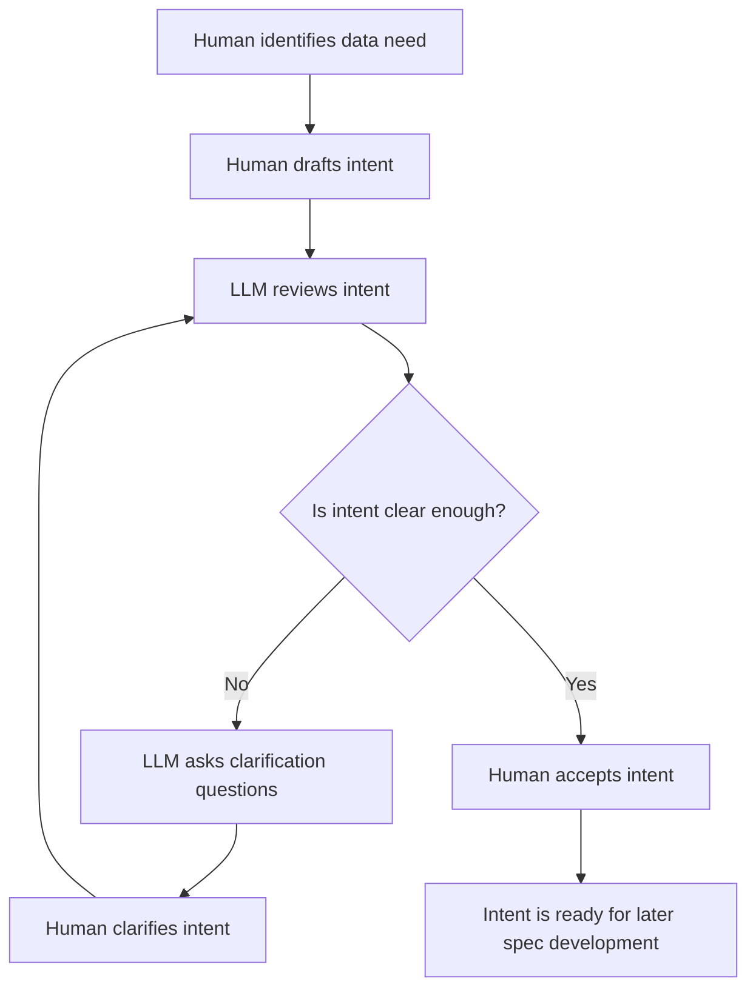
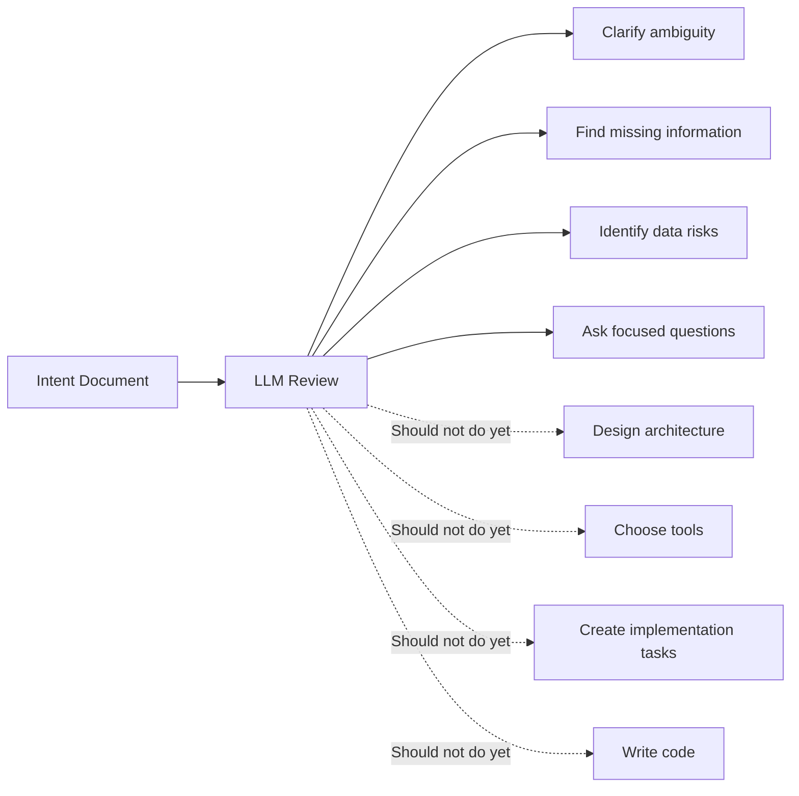
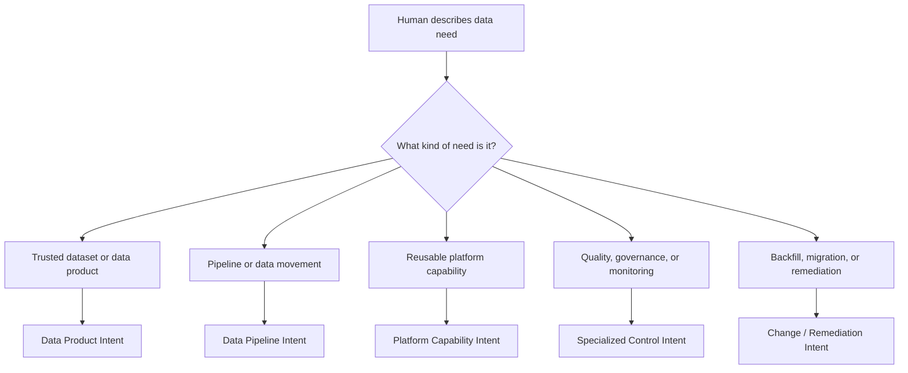
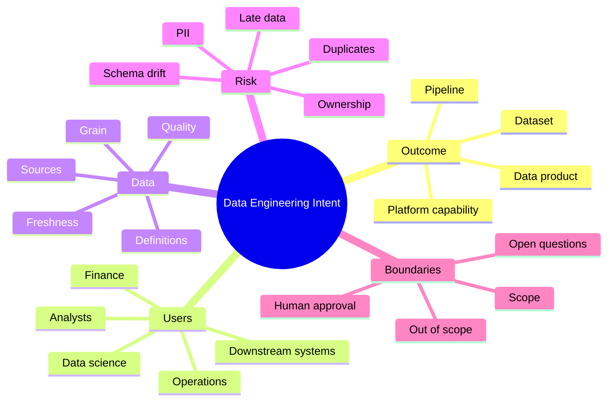
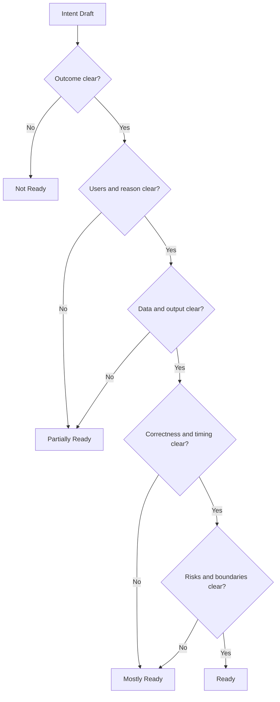

# Spec Development

## 1. Start With Intent

Spec development should begin before code, architecture, tools, or implementation plans.

The first artifact is the **Intent Document**.

Intent is the human explanation of:

- what outcome is needed
- why it matters
- who needs it
- what data is involved
- what correctness means
- what is out of scope
- what still needs clarification

For a Data Engineering or Data Platform team, intent is especially important because many failures do not come from bad code. They come from unclear business definitions, unclear data ownership, unclear grain, hidden quality assumptions, and vague expectations around freshness or correctness.

The intent document is written by a human. The LLM can review it, challenge it, and improve it, but the LLM should not become the owner of meaning.

## 2. Core Principle

> Intent is human-owned.  
> The LLM reviews clarity.  
> Engineering happens later.

At this stage, the goal is not to decide whether to use Spark, dbt, Airflow, Kafka, Databricks, Snowflake, BigQuery, Python, SQL, or any other tool.

The goal is to make sure the desired outcome is understood.

## 3. Intent Flow



The loop matters. A first draft is rarely complete. The LLM should help expose missing assumptions before engineering work begins.

## 4. What The LLM Should And Should Not Do



The LLM should act like a careful reviewer, not an implementation agent.

It should say:

> Here is what I understand.  
> Here is what is unclear.  
> Here is what is missing.  
> Here are the questions the human must answer.

It should not say:

> Here is the solution.

## 5. Intent Document Template

Use this template when a human is describing a data product, dataset, pipeline, platform capability, data quality need, or analytics engineering request.

```md
# Intent: <Short Name>

## 1. What Are We Trying To Achieve?
Describe the desired outcome in plain language.

## 2. Why Does This Matter?
Explain the business, operational, compliance, analytics, or platform reason.

## 3. Who Needs This?
List the users, teams, systems, reports, dashboards, or downstream pipelines that depend on this.

## 4. What Is The Current Problem?
Describe what is painful, broken, manual, risky, slow, inconsistent, or unclear today.

## 5. What Should Be Produced?
Describe the expected data output or platform capability.

## 6. What Data Is Involved?
List known source systems, tables, files, APIs, events, or reference data.

## 7. What Does Correct Mean?
Define correctness in business and data terms.

## 8. When Is It Needed?
Describe freshness, timing, frequency, SLA, or deadline.

## 9. What Must Be Protected?
Describe sensitive data, privacy, compliance, access, masking, retention, or audit concerns.

## 10. What Is Not Included?
List boundaries so the request does not grow silently.

## 11. How Will We Know It Worked?
Describe observable success.

## 12. Open Questions
List anything unresolved.

## 13. Human Owner
Identify the person or team that owns the intent and can approve whether it is correct.
```

## 6. Data Engineering Platform Intent Templates

A Data Engineering Platform team usually needs more than one kind of intent template. The same core questions apply, but the emphasis changes based on the type of work.

| Template | Use When | Primary Human Author | Key Intent Questions | Example Outcome |
|---|---|---|---|---|
| Data Product Intent | A team needs a trusted dataset or reusable data asset | Business owner, analytics lead, data product owner | Who needs this data? What decisions depend on it? What does correct mean? | Curated daily revenue dataset for Finance and Sales |
| Data Pipeline Intent | A new ingestion, transformation, or publishing pipeline is needed | Data engineer, analytics engineer, source system owner | What data moves from where to where? How often? What quality rules apply? | Daily customer order pipeline from raw source to curated table |
| Platform Capability Intent | The team is building reusable engineering capability | Data platform lead, platform architect, senior engineer | What repeated problem are we solving? Who will use the capability? What should become standardized? | Standard batch ingestion framework |
| Data Quality Intent | A dataset or pipeline needs explicit quality expectations | Data owner, data steward, data engineer | Which fields are critical? What checks are required? What happens on failure? | Quality rules for customer order summary table |
| Data Governance Intent | Ownership, access, lineage, privacy, retention, or classification needs clarity | Data governance lead, data owner, security/privacy partner | Who owns the data? Who can access it? What must be protected? | PII classification and access rules for customer datasets |
| Observability Intent | Pipelines or datasets need monitoring, alerting, freshness, or operational visibility | Data platform team, operations owner, data engineer | What must be monitored? Who gets alerted? What is the expected response? | Freshness and row-count monitoring for critical finance tables |
| Backfill / Migration Intent | Historical data must be loaded, corrected, migrated, or reprocessed | Data engineer, business owner, platform owner | What history is needed? What changes? How do we validate old vs new? | Three-year backfill from legacy order system |
| Source Onboarding Intent | A new source system, file feed, API, event stream, or vendor dataset is being introduced | Source owner, data engineer, vendor/system owner | What is the source? Who owns it? What is the contract? What can change? | Onboard CRM customer master into the lakehouse |
| Access / Consumption Intent | Users need a new access path, serving layer, API, semantic model, or export | Analytics lead, application owner, data platform owner | Who consumes the data? How do they access it? What latency and security constraints apply? | Certified analytics view for executive dashboard |
| Incident / Remediation Intent | A data issue requires correction and prevention | Data owner, support lead, data engineer | What broke? Who was impacted? What does corrected mean? How do we prevent recurrence? | Repair duplicated revenue records and add duplicate detection |

These templates should not force people into unnecessary process. They are starting points. The LLM can help choose the closest template based on the human's request.



## 7. Filled Example: Data Engineering Dataset

```md
# Intent: Daily Customer Order Summary Dataset

## 1. What Are We Trying To Achieve?
We want a trusted daily dataset that summarizes customer orders by business date, customer, region, and product category.

## 2. Why Does This Matter?
Sales Operations and Finance currently use different calculations for daily order totals. This causes inconsistent reporting in dashboards and executive summaries.

## 3. Who Needs This?
- Sales Operations analysts
- Finance analysts
- BI dashboard developers
- Executive reporting users
- Revenue forecasting team

## 4. What Is The Current Problem?
Analysts manually join raw order, customer, and product data. Each team applies slightly different filters and business rules. This creates duplicated work, inconsistent metrics, and low trust in reported numbers.

## 5. What Should Be Produced?
A curated warehouse table with one row per business date, customer, region, and product category.

Expected columns:
- business_date
- customer_id
- region
- product_category
- order_count
- gross_order_amount
- last_updated_timestamp

## 6. What Data Is Involved?
- Raw order transactions from the order management system
- Customer master data from CRM
- Product catalog data from the product data team

## 7. What Does Correct Mean?
- Cancelled orders are excluded.
- Duplicate order IDs are counted only once.
- Order amount excludes tax and shipping.
- Customer ID must not be null.
- Business date must not be null.
- Daily gross order totals should reconcile to the raw order source within 0.5%.

## 8. When Is It Needed?
The dataset should refresh daily and be available by 7 AM ET for the previous business date.

## 9. What Must Be Protected?
The output must not expose customer email, phone number, address, payment card information, or other direct PII.

## 10. What Is Not Included?
This request does not include:
- real-time streaming
- dashboard creation
- refund or return adjustment logic
- revenue recognition accounting rules
- machine learning feature engineering

## 11. How Will We Know It Worked?
- Sales Operations and Finance use the same table for daily reporting.
- BI developers no longer manually join raw order tables for this use case.
- Daily totals reconcile within the agreed tolerance.
- Users can see whether the dataset refreshed successfully.

## 12. Open Questions
- Should late-arriving orders update prior business dates?
- Should region come from billing address or assigned sales territory?
- How far back should historical data be loaded?
- Should reconciliation failure stop publication or only alert the owner?

## 13. Human Owner
Business owner: Director of Sales Operations
Technical owner: Data Engineering Lead
```

## 8. Data Engineering Intent Areas

For data engineering, a good intent document usually needs clarity across these areas:



## 9. LLM Intent Review Template

After the human drafts the intent, the LLM reviews it with a consistent structure.

```md
# Intent Review: <Intent Name>

## 1. Plain-Language Summary
Restate what the human appears to want.

## 2. Intent Readiness
Choose one:
- Not Ready
- Partially Ready
- Mostly Ready
- Ready

## 3. What Is Clear
List what the intent explains well.

## 4. What Is Ambiguous
List words, rules, outcomes, or assumptions that could be interpreted multiple ways.

## 5. What Is Missing
Check whether the intent includes:
- outcome
- reason
- users
- current problem
- expected output
- data involved
- correctness rules
- timing or freshness
- security and privacy
- out of scope
- success criteria
- open questions
- human owner

## 6. Data Engineering Concerns
Call out possible concerns:
- unclear grain
- unclear source of truth
- duplicate handling
- late-arriving data
- schema changes
- missing data quality rules
- missing ownership
- missing SLA
- sensitive data exposure
- unclear failure behavior
- unclear backfill requirements

## 7. Questions For The Human
Ask only the questions needed to improve the intent.

## 8. Suggested Intent Edits
Suggest wording or sections to add.
```

## 10. LLM Review Prompt

Use this prompt to make the LLM behave like an intent reviewer.

```md
You are reviewing a human-written intent document for a Data Engineering / Data Platform team.

Your job is to improve the intent, not to design a solution.

Do not write an implementation plan.
Do not propose technologies.
Do not create tasks.
Do not write code.
Do not invent business rules.

Review the intent for:
- clarity
- completeness
- ambiguity
- data engineering risks
- missing business definitions
- missing data expectations
- missing ownership
- missing success criteria
- unclear boundaries

Return:
1. Plain-language summary
2. Intent readiness
3. What is clear
4. What is ambiguous
5. What is missing
6. Data engineering concerns
7. Questions for the human
8. Suggested edits to the intent
```

## 11. Filled Example: LLM Intent Review

```md
# Intent Review: Daily Customer Order Summary Dataset

## 1. Plain-Language Summary
The human wants a trusted daily customer order summary dataset for Sales Operations, Finance, BI, executive reporting, and forecasting. The dataset should aggregate order activity by business date, customer, region, and product category, and should reduce inconsistent manual reporting.

## 2. Intent Readiness
Mostly Ready

The intent is strong enough to discuss with stakeholders, but several details should be clarified before later spec development.

## 3. What Is Clear
- The desired outcome is a curated daily order summary table.
- The business problem is inconsistent reporting.
- The primary users are identified.
- The intended grain is mostly clear.
- Freshness expectation is stated as daily by 7 AM ET.
- Basic quality rules are listed.
- Sensitive customer fields should not be exposed.
- Out-of-scope items are documented.

## 4. What Is Ambiguous
- "Region" could mean billing region, shipping region, sales territory, or current CRM region.
- "Gross order amount" may need a more precise definition.
- "Duplicate order IDs" requires a rule for which record wins.
- "Raw order source" should name the system or table used for reconciliation.
- "Late-arriving orders" is listed as an open question, but it is important enough to resolve.

## 5. What Is Missing
- Historical backfill expectation
- Retention expectation
- Access control group or user role
- Failure behavior when reconciliation fails
- Ownership of source data issues
- Expected behavior when customer or product reference data is missing

## 6. Data Engineering Concerns
- Late-arriving data could change previous business dates.
- Customer region changes could alter historical reporting if not handled carefully.
- Duplicate order handling could affect financial totals.
- Source schema changes could break the pipeline.
- PII must be prevented from flowing into the output.
- Missing failure behavior could cause disagreement during production incidents.

## 7. Questions For The Human
1. Which system or table is the source of truth for reconciliation?
2. Should region be based on billing address, shipping address, sales territory, or current CRM region?
3. Should late-arriving orders update previously published dates?
4. How far back should historical data be loaded?
5. What should happen if reconciliation differs by more than 0.5%?
6. Who should have access to the curated table?
7. What should happen when product category is missing?

## 8. Suggested Intent Edits
Add sections for:
- Historical Backfill
- Reconciliation Source
- Late-Arriving Data
- Access Control
- Failure Behavior
- Reference Data Handling
```

## 12. Intent Readiness Model



Readiness does not mean the solution is designed. It only means the intent is clear enough to move forward.

## 13. Practical Rule For Humans

When writing intent, avoid starting with:

```text
Build a Spark job that...
Create an Airflow DAG that...
Make a dbt model that...
Use Kafka to...
```

Start with:

```text
We need trusted data that...
Users need to know...
The current problem is...
Correct means...
This must be available by...
```

Technology choices can come later. Intent should describe the need before the mechanism.

## 14. First-Step Checklist

Before moving beyond intent, confirm:

- [ ] The outcome is understandable in plain language.
- [ ] The reason is clear.
- [ ] The users or consumers are identified.
- [ ] The expected output or capability is described.
- [ ] The involved data is listed.
- [ ] Correctness is defined.
- [ ] Timing or freshness is stated.
- [ ] Security and privacy concerns are documented.
- [ ] Out-of-scope items are documented.
- [ ] Open questions are visible.
- [ ] A human owner is named.
- [ ] The LLM has reviewed the intent.
- [ ] The human has accepted or corrected the LLM review.
